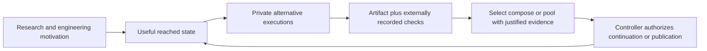

# Review of the 57 slide seminar and the revised talk

The talk asks how a computer can reuse a useful execution state, explore private next steps, and return a result that may be accepted. Its strongest contribution is the connected execution contract: reusable state, evidence about the exact returned artifact, and controller-held authority. The personal research path explains why that contract matters; the examples show its mechanisms and failure modes.

The revised main deck has **57 slides and 41:25 of planned narration**. The comments below preserve the original **1–57 numbering** from the published version. Each entry names its new location or its destination in Q&A. Supplemental source files remain available; the main PDF has no appendix or overlay builds.

## The story from beginning to end

1. **Motivation.** Container behavior learning, biological self-organization, sparse genomic representations, traceable ENCODE execution, CRISPR-IL feedback, PD-L1 combination assays and Mobileye perception lead to a recurring question: how does observed state determine the next action? These mechanisms remain distinct. Adaptive immunotherapy is an explicit direction; the cancer assays supply measured prior work.
2. **Execution model.** A film analogy explains alternative futures, and two Python snippets expose the proposed interface. Cached build artifacts establish a credible alternative to live-state reuse. The factory and runtime taxonomy define where execution happens; the fork definition declares the preserved state.
3. **Examples.** AFL++ demonstrates initialized-state reuse; sampling demonstrates candidate coverage; autoresearch and AlphaEvolve demonstrate evaluated search. Genomics and three-body continuation separate proposals from checked results. Factory repair and security validation show why passing, preserving and accepting are different operations.
4. **Runtime.** Choose files, live state or replay from the next action. Price preparation against capture, restore and divergence, including a warm cache. Record remote effects. Keep publishing credentials and current authority outside the copied guest.
5. **Evidence.** Select, compose and pool with different checks. Identify observations and shared information. Union/intersection, covariance weights, a forged precision declaration and the 9.17 calculation show why extra execution cannot assign its own statistical weight. Conditioned checkpoint success retains its task-start denominator.
6. **Acceptance.** Record what actually ran; check the exact artifact outside the child; preserve its bytes; authorize one result with current authority. Applied use cases match selection, code composition and numerical pooling to their checks. The planned experiments can change the runtime/dependence decision. Close on this contract.

## Editorial and scientific decisions

- Give each slide one question, mechanism or conclusion. Use a full-sentence title that answers it; put secondary methods and denominators in Q&A.
- Define a tool when it first appears: Cytosim, POSSUMM, CRISPR-IL/GoGenome, sbx, AFL++, autoresearch and the factory. Pair its name with what it does.
- Keep the numerical endpoints: chromosome 1 versus genome-wide data; creation versus restoration; stage time versus wall time; pass-at-least-once versus selected success; technical repeats versus independent experiments.
- The personal path uses dated milestones from the speaker’s own career website and the 2019 cancer-drug paper. Overlapping work periods and publication events are identified. Physical emergence, researcher-led biological iteration, perception, adaptive security and software orchestration remain different mechanisms.
- The proposed API expresses orchestration above ordinary Python and stored-program execution. Its operational decisions include captured state, private writes, an evaluator, a selector and controller acceptance.
- Retain the implemented behavior of each component. Duplicate rejection and lineage transport do not already implement dependence-aware abstention; a digest gate does not already supply every external behavior check.
- Keep the preregistration rejection thresholds and uncertainty rules. A non-significant result may remain inconclusive. The original protocol is unchanged; analysis amendments must precede collection.
- Use the newly added biology/security slides to deepen the motivation, and remove repeated shared-prefix/component diagrams to preserve pace.

## Added slides and their purpose

- **Twistlock.** Observe process/files/network/syscalls → learn an image model → alert or block deviations. The vendor reported learning usually plateaued around one hour of cumulative runtime. This supplies a concrete adaptive security mechanism.
- **CRISPR-IL / GoGenome with Noam Barkai.** Researchers’ measured editing outcomes inform the next model-guided design. Nextflow/AWS Batch and SageMaker implement the processing/learning path. Keep >20 TB and sub-second GOLD feature access attached to their actual endpoints. This follows ENCODE immediately.
- **PD-L1 combination design.** In E0771 cells, abemaciclib + SI-2 reduced PD-L1 induction while retaining cytotoxicity in a 72-hour assay. The approximate 10–100× range concerns different single-drug mRNA responses, not an invented combination reduction. This motivates multiple measured objectives in adaptive treatment design.
- **Isolation taxonomy.** VMs and microVMs run guest kernels; conventional Linux containers share a kernel; namespaces separate views; cgroups govern resources; a sandbox applies access/action policy. Docker Sandboxes (sbx) uses a microVM and private Docker daemon. This immediately follows the factory introduction.
- **Runtime bridge.** Run → externally recorded evidence → accept establishes the technical chapter’s jobs.
- **Evidence bridge.** What ran and what was shared explains the move from private machines to justified information.

## Comments on every original slide

### 1 Forkable sandboxes let computers explore executable alternatives.

**Keep and tighten. New main slide 1.**

Open with the computational question: after reaching a useful state, can we try several next actions and return a result we can accept? Name forkable sandboxes and self-driving compute immediately. Keep the cover sparse; the research map follows it.

### 2 Forkable computation lets us try different futures from the same state.

**Move after the motivation. New main slide 10.**

Keep the cinema analogy to explain the operation: replay repeats a path; a fork tries different continuations from one reached state. End with checkpoint → alternatives → check → continue. Use an operational example rather than an extended entertainment metaphor.

### 3 An adaptive controller chooses programs and continuations; IF and LOOP still execute them.

**Replace the abstract comparison. New main slide 11.**

Show the same three edits and checks in two Python snippets. The ordinary loop prepares three environments; the proposed forkable API prepares one parent and creates three private children. Explain checkpoint, fork, execute, evaluate and select. Identify the interface as a proposed API sketch; ordinary Python still implements it.

### 4 My work connects biological experiments, genomic pipelines, and autonomous execution.

**Rewrite as a dated timeline. New main slide 2.**

Put the milestones into verified chronology: protect running software (2010–2016); model cells and genomes (2016–2021); test cancer-drug combinations (2019 result); learn from gene-editing outcomes at NRGene (2020–2021); recognize roads at Mobileye (2021–2024); try and check program alternatives at Incredibuild (2025–2026). Use action titles before names. Dates are overlapping career periods except the explicitly dated 2019 paper. Keep the adaptive-immunotherapy direction in the science context rather than presenting it as an accomplished clinical system.

### 5 Higher linker valency changed simulated actomyosin structure.

**Rewrite the framework and motivation. New main slide 4.**

Define Cytosim as a driven cytoskeleton model with flexible actin filaments, binding proteins and myosin motors. Explain the graph: filament = node, protein connection = edge; cliques and communities quantify organization. Retain binding sites 2–7, 600 s and 30 random starts in the reported comparison. Relate CaMKII/actin architecture to neuronal-spine plasticity and contraction. Remove the first-author footer comment.

### 6 A sparse algorithm made 500-bp chromosome analysis feasible.

**Rewrite around the sparse graph. New main slide 5.**

Hi-C measures weighted contacts between DNA regions. POSSUMM computes the compartment pattern through sparse matrix-vector operations without materializing the dense correlation matrix. Keep the chromosome-1 endpoint: 500 bp, 23 GB, 2.5 min, versus a >4.6 TB dense projection. Define A/B as active/inactive chromatin. Replace the crowded RAM-axis diagram with the mechanism and three values.

### 7 ENCODE linked reproducible execution to identifiable outputs.

**Keep and connect to CRISPR. New main slide 6.**

Explain the executable chain WDL → Cromwell → Docker and identifiable outputs, with >14,000 datasets as the scale anchor. The point is traceable production, not a pipeline-tool inventory. Follow this immediately with GoGenome: the next design can change after measured feedback.

### 8 A self-driving computer closes a feedback loop around its own actions.

**Keep and shorten. New main slide 9.**

Keep the credited Mobileye Manhattan photograph and personal junction-perception role, 2021–2024. The updated main example shows road sensing and anonymized data transmission from the speaker-supplied assumption of 300 million Mobileye-equipped cars, alignment of repeated drives along the same road, aggregation into the HD Roadbook and map distribution back to vehicles. The photo caption identifies an autonomous test vehicle (AV). The service acronym is removed from visible content. The pedestrian/braking loop and software-edits analogy remain visible. Fleet observation/aggregation motivates the next private-alternative execution slides without calling cars checkpoint clones.

### 9 Reusing build artifacts reduced a reported Tokio compile from 46 to 13 seconds.

**Keep the warm baseline. New main slide 12.**

Show the reported Tokio build at roughly 46 s fresh, 13 s after artifact-cache restoration, and 3 s with a hot cache. Say which state is reused: build artifacts. This makes the later restore-versus-warm comparison motivated by a real engineering alternative.

### 10 An agent changes the environment that executes its next experiment.

**Clarify tools and add taxonomy. New main slide 13.**

The factory edits the environment used by its next experiment. Name Airflow, sandboxes via Docker Sandboxes (sbx), and Databricks-hosted models. Put the serial-run scope in notes. Add the requested VM/microVM/container/sandbox/cgroups comparison immediately afterward; Docker Sandboxes is a microVM-based product, not an ordinary container.

### 11 Alternative experiments can share the work already completed.

**Remove the repeated main slide. Q&A and retained source; removed from main narration.**

The shared-prefix point is already visible in the cinema diagram, Python API and fork definition. Preserve its useful-state qualifications in notes. The opening needs concrete motivation more than another statement that completed work can be reused.

### 12 A fork creates private continuations from one captured execution state.

**Keep the definition. New main slide 15.**

Capture one declared parent state; create private continuations; return artifacts and observations. Specify what is private and what remains outside capture, including remote effects and publication authority. This is the last opening slide and the entry into examples.

### 13 AFL++ forks initialized state once and resets between inputs.

**Define AFL++ before its mechanism. New main slide 17.**

AFL++ is a bug-finding fuzzer: mutate inputs, execute the target, retain inputs that reach new paths, investigate crashes. Then show deferred initialization → persistent child → reset, with about 1,000 inputs before restarting the child. This makes initialized-state reuse concrete for a non-security audience.

### 14 AFL++ reports 10–20 times faster execution in persistent mode.

**Keep the attributed value. New main slide 18.**

Keep the documentation’s typical 10–20× persistent-mode speedup and the reset condition. Explain that persistent execution amortizes repeated process creation. The numerical gain belongs to that mode and workload; it is not a general claim about all forks.

### 15 250 samples raised SWE-bench Lite coverage from 15.9% to 56%.

**Keep coverage distinct from selection. New main slide 19.**

Retain SWE-bench Lite coverage 15.9% → 56% with 250 samples. Explain that a correct patch appeared among the candidates. A separate selector must recognize and choose it. This is the transition from more trials to decision quality.

### 16 Autoresearch kept 23 experiments and lowered validation bits per byte.

**Keep the experiment loop. New main slide 20.**

Name autoresearch and show edit → fixed five-minute evaluation → keep/revert. Retain 126 attempts, 23 kept changes, 102 discards, one crash, and validation bits per byte 0.997900 → 0.969686. The insight is a concrete feedback rule with a preserved evaluator.

### 17 AlphaEvolve recovered 0.7% of Google's worldwide compute.

**Keep the program population and production result. New main slide 21.**

Name Gemini Flash/Pro, program proposals, automated validity/performance checks and evolutionary selection. Keep the reported 0.7% average worldwide compute recovery. Tie that value to the deployed scheduling heuristic discovered by the loop; the result is not a sandbox benchmark.

### 18 A genome-scale screen ranked candidates for sensitivity to SI-12.

**Keep candidate generation. New main slide 22.**

Explain the laboratory screen, computational ranking and focused follow-up as separate stages. Over 120,000 guides cover 19,050 genes, with six guide variants per gene. Three treatment/control conditions and three repeat cultures each give nine pooled arms. The slide explains that DRACO requires four of six guides to agree in direction before ranking. Gene-level analysis nominates approximately 100 candidates, a roughly 190-fold narrowing. Eight drug-target choices and five additional genes led to focused checks. SI-12 blocks a protein that supports cancer-cell growth; the vehicle condition is the untreated comparison.

### 19 Six of eight combinations improved killing in MCF-7 cells.

**Keep independent validation. New main slide 23.**

Show the two focused follow-up paths in MCF-7 human breast-cancer cells: genetic checks found increased SI-12 sensitivity for 10 of 13 targets, and six of eight tested drug combinations improved killing. Define the readout and distinguish technical replicates from independent experiments. These are in-vitro findings, separate from the earlier SI-2 / PD-L1 experiment.

### 20 We tested whether projected three-body orbit branches connect.

**Keep the physics question. New main slide 24.**

Name Ori Chamo and the 135,445-orbit catalog. A separation in a projected drawing can hide a connection in the full solution space. Explain continuation with shooting correction as the check; the audience should know what “connected” means before seeing the count.

### 21 All 26 selected links connected by bidirectional continuation.

**Keep the checked result. New main slide 25.**

Retain all 26 selected links connecting bidirectionally, Floquet stability analysis and representative 60-digit checks. Keep Extra-Trees warm-start proposals separate from numerical acceptance. The result concerns the selected links in a sampled component, giving a clear boundary to the conclusion.

### 22 The installer fix added two missing hosts across a six-file plan.

**Explain the feedback loop. New main slide 27.**

Use the concrete setup goal to show agent change, behavior tests, review and the return path for failed checks or requested changes. The workflow ran serially. Move download domains, the six-file plan and tool configuration into Q&A.

### 23 The factory run took 43:44 and cost $10.33 in model calls.

**Explain private fan-out. New main slide 28.**

Show one prepared state supporting three private edit/test trials. Label this proposed parallel design and keep the measured serial baseline explicit. Retain all stage timings, wall-time distinctions and model cost in Q&A rather than the main diagram.

### 24 Two repairs and two reviews used 59% of time and 75% of cost.

**Explain result fan-in. New main slide 29.**

Collect the proposed changes with their test results, choose one or compose compatible changes, and check the exact final version. Retain the 59%/75% repair-review cost comparison in Q&A. Do not claim that the illustrated merge ran in the measured factory workflow.

### 25 The repair agent diagnosed a split between cell and dispatch ownership.

**State the proposed contribution. New main slide 30.**

Connect reusable execution to returned changed files, the checks that ran and shared-input history. A coordinator uses that evidence to decide what to keep. Attribute novelty to the integrated execution/evidence/acceptance contract, without priority or speedup claims. Keep the detailed dispatch race and scope diagnosis in Q&A.

### 26 The green suite left same-owner adoption without a direct test.

**Explain the targeted behavior check. New main slide 31.**

Use a simple retry example: force the retry, run the repaired code and count exactly one job start. Explain the observed missing direct check in plain language. Keep CellBusy, authorization, same-job ownership, the 1,972-case count and skipped-case qualifications in Q&A. This is an unresolved obligation, not proof that the patch fails.

### 27 Three delivery refusals preceded cleanup that erased an approved patch.

**Explain durable output. New main slide 32.**

Show the proposed order: checked result, save outside the temporary workspace, confirm the saved copy, then cleanup. Keep the observed patch loss in the separate run visible at a high level. Preserve costs, refusal count and extra archive-file cause in Q&A. Durable storage does not authorize publication.

### 28 CyberGym validated 22 zero-days after a 56-crash campaign.

**Keep validated security outcomes. New main slide 33.**

Retain the CyberGym campaign’s 56 crashes and 22 confirmed zero-days, with benchmark and latest-code campaign populations clearly separated. Crashes are leads; reproduction, confirmation and deduplication establish vulnerabilities. This closes the examples with the same proposal/check/accept pattern.

### 29 The next action determines which state a continuation needs.

**Keep the state menu. New main slide 35.**

Three rows: files/cache/worktree for editing; process or VM snapshot for live execution; recorded calls/answers for replay. The next action determines which state is needed. Include supported memory/program-counter semantics where relevant, and explain that code reload can invalidate a previously useful live state.

### 30 A RAM-only nonce tests memory restoration in three children.

**Move to Q&A. Q&A and retained source; removed from main narration.**

Keep the RAM-only 128-bit nonce and three-child probe in the state-choice Q&A. It is a proposed necessary check, not an executed result or full fidelity certificate. Main narration only needs the requirement that preserved state match what the continuation consumes.

### 31 A checkpoint and a remote fork time different operations.

**Move to Q&A. Q&A and retained source; removed from main narration.**

Retain DeltaBox’s 10.83 ms checkpoint and SnowFlock’s 600–800 ms remote clone with their operation boundaries. The main story does not need an incomparable timing survey. A local capture and a copy across hosts answer different questions.

### 32 islo completed 255/256 restore–run–capture calls at a 6.87 s median.

**Replace the visible trace. New main slide 36.**

Show one sandbox create batch: 256/256 completed, requested concurrency eight, median 3.44 s, p95 9.00 s. The creation trace is not a vendor ranking; Tensorlake is named in the spoken note. A separate dated ComputeSDK slide updates the current startup landscape. State create-from-default-environment and the client timing endpoint. This supplies a concrete operational value without a vendor ranking.

### 33 Reuse saves resources when avoided preparation exceeds its overhead.

**Keep the resource inequality. New main slide 38.**

Use (N−1)P > H + N(R+D). Define every symbol: repeated preparation, one capture, child restore, private divergence, child count. Common execution work cancels. These are additive resources; batch elapsed time also depends on scheduling and contention.

### 34 A warm cache can reverse the resource advantage of restoration.

**Redraw as paired bars. New main slide 39.**

Use the same 34 resource-seconds overhead in both comparisons: 2 + 8×(1+3). Cold P=30 avoids 210 and saves 176. Warm P=2 avoids 14 and loses 20. Only repeated preparation changes. Plot avoided work and overhead on the same scale.

### 35 Restoring a guest cannot undo a completed remote model request.

**Keep the irreversible remote effect. New main slide 40.**

A restored guest does not undo a model request that already left, its answer or its bill. Explain staged sends where possible and durable request/response recording for supported replay. The boundary concerns external observations and effects, not just files inside the sandbox.

### 36 The controller holds the credential that publishes a child's candidate.

**Keep authority outside the child. New main slide 41.**

The sandbox returns the candidate and check records; the controller owns the publishing key and verifies the exact artifact digest. State the exercised digest gate. The external-check and full acceptance requirements remain distinct design responsibilities.

### 37 The factory routes candidate digests through a controller publication gate.

**Remove the repeated component diagram. Q&A and retained source; removed from main narration.**

Its solid path repeats the publication gate, while dashed future components add distraction. Preserve implementation-versus-design detail in Q&A. The three-job bridge supplies the architecture at the level the main argument needs.

### 38 The controller rejects an old epoch after replacing a worker.

**Keep replacement fencing. New main slide 42.**

Give each authorized worker a generation; replacement advances it. A delayed request from the old generation is rejected outside the guest. Concurrent forks have separate identities. Label the epoch protocol as design and connect it directly to controller-held authority.

### 39 Selecting, composing, and pooling results require different checks.

**Keep as the decision menu. New main slide 44.**

Pick one patch: test that patch. Compose several: test the exact composition. Pool common-target measurements: validate identity, information and sharing. These are different acceptance operations, each with a different evidence requirement.

### 40 Passing every pair does not establish that all three patches pass.

**Keep the composition counterexample. New main slide 45.**

Each pair passes while all three together fail. One simple capacity example is enough; the important conclusion is to test the artifact actually being shipped. Pairwise compatibility and numerical pooling cannot supply that behavioral check.

### 41 Four runs of 100 cases produce 400 outcomes in 100 case clusters.

**Move to Q&A. Q&A and retained source; removed from main narration.**

Retain 400 outcomes from 100 cases as the bookkeeping example behind evidence IDs and replicate units. It explains repeated outcomes versus case identities without adding another main-slide statistical detour.

### 42 Linking Bitcoin addresses recovered 64 agents behind most early mining.

**Move to Q&A. Q&A and retained source; removed from main narration.**

Keep the 64-agent Bitcoin identity reconstruction as related prior work. It supports “distinct records may share a source,” but it does not establish agent-fork covariance. In the main talk, the duplicate-ID rule makes the operational point directly.

### 43 Different parents can still share the evidence that guides their children.

**Fold into the reducer slide. New main slide 48.**

One line suffices: different parents may still use the same grader. Preserve execution ancestry and information-sharing links in Q&A. Neither graph automatically supplies a covariance estimate.

### 44 The reducer rejects a repeated evidence ID and retains distinct evidence.

**Keep and separate implementation from acceptance design. New main slide 48.**

The built reducer rejects an exactly repeated declared evidence ID and carries lineage. Distinct IDs do not prove independence. The proposed acceptance layer refuses an unsupported pooled claim when shared information or calibration cannot be justified. Avoid describing abstention as already implemented.

### 45 Information pooling reduced the synthetic MLE gap from 0.177 to 0.0083.

**Move to Q&A. Q&A and retained source; removed from main narration.**

Retain the honest synthetic pooling result 0.177 → 0.0083, five uneven shards and eight fixed seeds in the precision-stress Q&A. It shows when the numerical model works. The main story focuses on how a confidence declaration can break it.

### 46 A forged precision report moved the synthetic pooled estimate from 5 to 17.

**Keep the synthetic precision attack. New main slide 50.**

A 2,000-point shard aimed at 17 and inflated information per point 50×, moving the unprotected estimate from a true mean of 5 to 17.0004. Keep the particular heuristic result 4.9566 clearly labeled. The design requires trusted or calibrated weights; this demonstration supplies no general Byzantine guarantee.

### 47 At correlation 0.1, 100 measurements have the mean precision of about nine.

**Keep one dependence number. New main slide 51.**

At common correlation 0.1 and equal marginal variance, 100 measurements have the mean precision of 9.17 independent measurements. State the assumptions alongside the formula. This is variance-equivalent precision, not a probability of correctness or a literal count of independent cases.

### 48 Zero pairwise correlation can coexist with an all-wrong rate of 25 percent.

**Move to Q&A. Q&A and retained source; removed from main narration.**

Retain the exact example where zero pairwise correlation coexists with joint all-wrong rates 0, 12.5% or 25%. It prevents treating effective sample size as a candidate-search guarantee, without interrupting the main acceptance argument.

### 49 Shared variation can make a paired comparison more precise.

**Move to Q&A. Q&A and retained source; removed from main narration.**

Retain common-random-number/paired-comparison reasoning: sharing may help estimate a difference while giving fewer independent witnesses. Control the randomness actually consumed; a guest seed does not control a hosted model. The point qualifies the dependence analysis rather than adding a new main thesis.

### 50 Success after reaching a checkpoint does not measure success from task start.

**Keep the conditioning example. New main slide 52.**

Reach the checkpoint with probability 0.5 and succeed from it with probability 0.8: task-start success is 0.4. These are illustrative probabilities. Forking after the plan inherits the selected starting point and earlier decisions; define the population behind every reported success rate.

### 51 A receipt must describe the operation that actually executed.

**Keep concrete receipt semantics. New main slide 53.**

CI “success” finished in three seconds because evaluation was skipped; “human approval” was answered by the harness; a digest referenced bytes outside Git. Record actor, actual check, exact artifact and durable bytes. Each positive label must identify the event it really represents.

### 52 Publication must follow a passing check of the exact artifact.

**Keep the rule on the recorded bug. New main slide 54.**

Return to the missing busy-path test. Freeze the artifact; run the required behavior check outside the child; bind its receipt to the digest; let the controller publish those bytes under current authority. Export before cleanup. This is the concrete acceptance contract, not a new assertion that the observed patch was incorrect.

### 53 The runtime experiment compares faithful restore with warm reconstruction.

**Retain the protocol in Q&A; main slide 54 now explains applied merge cases.**

Keep faithful restore versus equivalent warm reconstruction, fanouts 3/6/12 and 20 interleaved batches per arm. The preregistered rejection rule uses an upper 98.3% confidence bound below ten seconds at any fanout. A noisy estimate below ten seconds can remain inconclusive.

### 54 The cofailure experiment compares siblings with other checkpoint families.

**Retain the protocol in Q&A; main slide 54 now explains applied merge cases.**

Keep siblings versus other checkpoint families in matched slots, with a consumed parent-state feature. The rejection rule’s upper 90% bound below 0.05 rules out the prespecified excess of that size; it does not prove all independence. State that collection has not started and preserve the original protocol and thresholds in Q&A.

### 55 Overlapping families and repeated rounds require grouped analysis.

**Move to Q&A. Q&A and retained source; removed from main narration.**

Retain the overlapping-family and repeated-round analysis limitation as a pre-collection amendment requirement. It qualifies the design rather than supplying a result. Preserve the immutable protocol and date any actual analysis change.

### 56 Nine fixed-input repairs test whether the recorded behavior repeats.

**Move to Q&A. Q&A and retained source; removed from main narration.**

Retain the nine fixed-input repairs as a descriptive repeatability plan, including lost-input/public-substitute limits. They do not estimate a fork-induced effect. Keep direct behavioral testing and repeatability as separate questions.

### 57 A useful continuation returns its artifact, evidence, and authority context.

**Close on the contract. New main slide 56.**

Reuse the state. Run private alternatives. Check exact artifacts and evidence outside the child. Then continue or authorize publication once. The boundary the child cannot cross is the closing systems insight; the ending should introduce no new comparison, acronym or thesis.

## Primary sources for the newly clarified context

- [Twistlock January 2017 technical newsletter](https://cdn.twistlock.com/docs/TechNews/Twistlock_Jan17_1_7.pdf).
- [Actomyosin graph paper](https://doi.org/10.1103/PhysRevE.102.062420) and [Cytosim documentation](https://gitlab.com/f-nedelec/cytosim).
- [POSSUMM and chromatin compartments](https://doi.org/10.1038/s41467-023-38429-1).
- [Noam Barkai and Yossi Eliaz on CRISPR-IL/GoGenome](https://aws.amazon.com/blogs/storage/a-gene-editing-prediction-engine-with-iterative-learning-cycles-built-on-aws/).
- [PD-L1 combination study](https://doi.org/10.1038/s41598-019-51537-7).
- [AFL++ technical details](https://aflplus.plus/docs/technical_details/) and [persistent mode](https://github.com/AFLplusplus/AFLplusplus/blob/stable/instrumentation/README.persistent_mode.md).
- [Docker Sandboxes architecture](https://docs.docker.com/ai/sandboxes/architecture/), [Firecracker](https://firecracker-microvm.github.io/) and [Linux cgroup v2](https://docs.kernel.org/admin-guide/cgroup-v2.html).

## Complete input checklist for this revision

Every supplied screenshot and the pasted original 57-slide review has a destination. The final pass also incorporates the guide/repeat clarification, researcher-selected drug types, current AV caption, and simplified Chamo stability figure. The screenshot deck’s 50-slide numbering differs from the original 57-slide numbering above; this table uses the final 57-slide deck.

| User input | Final slides | Applied change |
|---|---|---|
| Include all final comments and finish the deck | 1–57 | Source, notes and rendered output reviewed as one cumulative task. |
| Add Eliaz to the POSSUMM citation | 5 | Harris et al., including Eliaz, with the original paper/figure reference preserved. |
| Replace ENCODE source-ID jargon | 6 | Traceable results: which data, which software, and quality checks. |
| Explain CRISPR-IL, pre-lab screening and the biology reduction | 7–8, 22–23 | Plain model/experiment feedback, separate OffRisk pre-lab prioritization, and 19,050 to approximately 100 to 13 genetic targets / 8 drug combinations with distinct measured endpoints. |
| Use 300 million Mobileye-equipped cars from firsthand experience | 9 | Speaker-supplied 300M fleet assumption, anonymized data transmission and AV test-vehicle caption. No service acronym in visible content or false public verification. |
| Explain restored versus hot cache | 12 | Saved build files copied into a fresh runner versus files already available from the previous build. |
| Explain the CyberGym numbers and actual process | 33 | Projects, executable targets, generated crashes and distinct validated vulnerabilities have separate labels and a concrete execution/check flow. |
| Add fan-out / fan-in strategies using set ideas | 46–47 | Union, intersection and difference; five common strategies with the matching merge and check, plus limitations in Q&A. |
| Give every fan-in row a mathematical operator; consider max, average and ReLU | 47 | Union, eligible-candidate argmax, compatible edit merge, normalized weighted mean and intersection. Max/argmax distinction and ReLU definition are explicit. |
| Add an insightful numeric conclusion | 57 | 46 to 13 seconds, 15.9 to 56 percent coverage, and 100 to 9.17 effective independent estimates. No combined performance claim. |
| Simplify slides 26–31 around paradigms, theory, contribution and flows | 27–32 | Six plain-language flows for feedback, private fan-out, fan-in, returned evidence, a targeted check and durable output. Incident detail retained in Q&A. Measured serial baseline distinguished from proposed parallel design. |
| Redo the deck end to end; review original slides 1–57 | 1–57; review entries 1–57 above | Connected six-act story, canonical map and timed notes; retained material has an explicit Q&A destination |
| Put the research map in the right timeline; explain the work before naming tools | 2–9 | Verified chronological milestones, action headings and definitions for CS undergraduates |
| Make the driving example concrete and exciting | 9 | Credited official Mobileye Manhattan photograph; personal junction-perception role, pedestrian/braking feedback and software-edit analogy; worldwide fleet fan-in uses plain wording |
| Show worldwide car observations merging into Roadbook; check the proposed 300 million/every-second claim | 9 | Speaker-supplied assumption of 300 million Mobileye-equipped cars sensing and transmitting anonymized data, same-road alignment and HD Roadbook feedback. The photo is an autonomous test vehicle (AV). Separately dated 34 billion 2025 mapping road-miles gives ~1,080/second as an annual average, without implying a rate for all 300M cars |
| Say sandboxes; show sbx and hosted-model execution; keep serial scope clear | 13, 27 | Sandbox wording, sbx command, Airflow and Databricks; recorded runs remain serial |
| Compare VM, microVM, container, sandbox and cgroups together | 14 | One table distinguishes guest kernels, shared kernels, resource limits and policy boundaries |
| Explain why caching makes repeated trials practical | 12, 38–39 | Build cache example: 46 / 13 / 3 seconds; restored artifacts save about 33 seconds; warm-cache alternative in reuse calculation |
| Define AFL++ and correct the actors and arrows | 17–18 | Controller mutates/retains inputs; target runs/resets state; initialized forkserver and persistent-child restart |
| Generalize the cancer example, explain SI-12 and use numbered fan-out / fan-in | 22 | >120,000 guides for 19,050 genes, six guide variants per gene, three conditions with three repeats (nine pooled arms), and four-of-six agreement before DRACO ranking; about 100 gene candidates and approximately 190-fold narrowing use gene-level units |
| Explain MCF-7 and why multiple arms work; clarify merge/reduce | 23 | Human breast-cancer cells; 13 genetic targets and eight drug combinations are checked separately; 10/13 and 6/8 outcomes retain their distinct units; independent assays are compared, not mixed |
| Improve physics visuals and preserve the actual question/result | 24–26 | Two projected branches versus a verified continuation connection; 5 + 20 + 1 bidirectional checks; a new plain-language schematic of the two representative stability mechanisms |
| Add candidate / possibility counts to the PD-L1 slide and show how experiments find signal | 8 | Ten compounds in E0771 (six shared-panel + four additional); 45 theoretical pairs at one dose each; ten-drug comparison, two readouts and researcher-selected follow-up; the chosen drugs' mechanisms are explained and the larger CRISPR search remains distinct |
| Make fan-out/fan-in the examples’ recurring message | 16, 22–25, 34, 56 | Shared setup, changed alternatives, gathered observations and checked outcomes; biological/numerical analogies stated precisely |
| Simplify installer, timing, repair and test slides | 27–31 | High-level feedback, fan-out/fan-in, returned evidence and direct behavior-check flows; all original incident details retained in Q&A |
| Remove SELFHOST-2 metrics/repair/review footer wording | 27–31 | Plain visible source descriptions; internal record IDs retained in source/Q&A for traceability |
| Explain delivery loss and remove SELFHOST-3 footer/separation prose | 32 | Proposed save/confirm/cleanup order; observed patch loss stated simply, original refusal chronology retained in Q&A |
| Add transitions / sub-agendas | 16, 34, 43 | What the examples show; runtime’s three jobs; how results add information before acceptance |
| Find the fastest current ComputeSDK result and show progress since the paper | 36–37 | Paper creation trace plus dated 2 October 2026 Burst TTI leaders; Isorun 73 ms median, 78 ms p95; endpoints kept distinct |
| Explain reuse equation terms and improve warm-cache title | 38–39 | Plain definitions of setup, save, restore, private changes and trial count; cold/warm paired bars with fixed overhead |
| Simplify remote effects and controller authority | 40–41 | Restoring a sandbox does not undo a completed API call or bill; publishing key stays with the controller |
| Explain epoch in plain English and its relation to scheduling | 42 | Scheduling assigns work; the permission-version check blocks outdated publication. Version advances from 1 to 2; a late version-1 request is rejected |
| Focus aggregation on new information and signal-to-noise | 43, 46–51 | Distinct observations, shared error, calibrated weights, variance-equivalent count and noise/SNR interpretation |
| Explain selection, composition, pooling, union, intersection and mutual information | 44, 46, 49, 55 | Applied result menu, observation Venn diagram, separate entropy identity and covariance pooling formula |
| Make the pairwise-composition counterexample concrete | 45 | Each edit starts a 1 GB worker on a 2 GB server: every pair fits; all three exceed capacity |
| Simplify duplicate evidence and explain independence | 48 | Observation 42 twice counts once; 42 and 43 can still share errors; IDs and lineage are retained |
| Add a concise equation to the forged-precision example | 50 | Weighted mean with inverse-variance weights; 17.0004 versus 4.9566 remains a synthetic stress result |
| Explain the meaning of 100 measurements becoming about nine | 51 | Equal-noise/common-correlation model; 9.17 variance-equivalent independent estimates; noise 0.33 versus 0.10, SNR gain about 3 versus 10 |
| Explain checkpoint versus end-to-end success | 52 | 100 start, 50 reach the checkpoint, 40 finish: 80% from checkpoint and 40% from task start |
| Explain receipts, hashes, checks and publishing in undergraduate English | 53–54 | Record who ran which check on which files; preserve the code itself; publish the same tested files |
| Remove the PREREGISTRATION.md footer; explain merge use cases | 55 | Models, code, measurements and drug/orbit candidates each get a merge rule and check; planned status remains visible, protocol unchanged |
| Improve conclusion and final message | 56 | Reuse → three separate trials → gather/combine/check → accepted continuation; shared evidence once and controller acceptance |

The protocol remains byte-for-byte unchanged. Hidden Q&A preserves operation boundaries, source identities, biological scope, selection versus validation, and the original rejection thresholds. No supplied comment is treated as evidence of an unperformed experiment.

## Final visual review, 4 October 2026

All 57 rendered slides were inspected together and the changed slides were inspected individually at 1,600 pixels wide. The final pass checked titles, arrow direction, branch identity, axes, units, legends, text wrapping, citations and the separation of measured results from proposed flows. Expanded labels initially crowded slides 8, 22, 24 and 26; the final layouts shorten those labels and preserve the readable type scale. The physics projection uses schematic scaled period/angular-momentum axes and the same A/B identities in both views. The two stability rows explain the public paper's representative mechanisms without treating local stability as a connectivity test. Slide 42 distinguishes scheduling from permission fencing.

The full build has 57 pages and 41:25 of planned narration. Every slide has a timed cue and preserved Q&A. The render contains all required displayed content and the final TeX log has no overfull or underfull boxes. The protocol remains unchanged. The prior Mobileye update, including the 300M speaker-supplied fleet assumption, anonymized data and AV test-vehicle caption, remains present.
