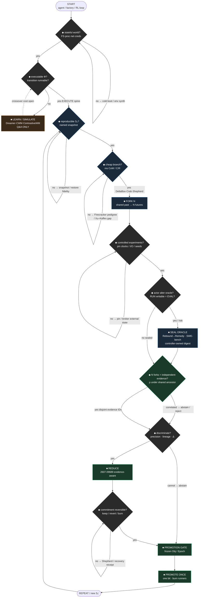

# FLOW-GATES-PAPERS — FINAL annotated decision flowchart
**Lock:** 2026-09-28 (IDT) · CompLab SRG + paper writing  
**Source flowchart:** START → stateful world? → executable Φ? → LEARN/SIMULATE vs EXECUTE → reproducible S₀? → cheap branch? → FORK N → controlled experiments? → actor alter oracle? → N forks independent evidence? → discriminate? → REDUCE → commitment reversible? → PROMOTION GATE → PROMOTE ONCE → REPEAT  
**Aligns:** `scratch/AGGRESSIVE-SPINE.md` · `scratch/PAPER-STAGE-MAP.md` · `CLAIM-FENCE.md` · `scratch/PAPERS-AND-SOURCES.md`  
**Primary stack:** A chassis (fork substrate) + C payload (evidence-aware reduce · **2607.09689**)

---

## 0. How to read this file

| Symbol | Meaning |
|---|---|
| ◆ diamond | Decision gate (yes/no or branch) |
| ■ box | Action / invariant node |
| **EXECUTE spine** | Systems path for CompLab hour — MAIN cites on stage |
| **LEARN/SIMULATE branch** | World-model / imagination path — **Q&A only**; Dreamer/CWM **never** on EXECUTE slides |
| **HIS** | Yossi’s net-new claim (2607.09689 + Fork/Reduce/Promote contract) |
| **Cousin** | Peer system that owns a gate’s *mechanism* but not Yossi’s reduce/promote thesis |

**Claim-fence rule for every gate:** state whether the cite is **mechanism** (systems object you can implement/measure) or **analogy** (interpretive cousin — one sentence max, never load-bearing).

---

## 1. Mermaid — paper tags on nodes/edges



---

## 2. ASCII — compact stage card

```text
                         START
                           |
                    ◆ stateful world?
                      no|        |yes
                 (boot/env)      |
                           ◆ executable Φ?
                      no/           \yes ═══════════════ EXECUTE SPINE
                       |              |
         ■ LEARN/SIMULATE          ◆ reproducible S₀?
         Dreamer / CWM               no|     |yes
         ContrastiveWM                 |     |
         (Q&A ONLY) ─crossover──►      ◆ cheap branch?
                                   no|        |yes
                              (Xu–Kaffes gap) |
                                         ■ FORK N
                                    Firecracker·DeltaBox
                                    Crab·Shepherd
                                           |
                                  ◆ controlled experiments?
                                      no|        |yes
                                    (pin)        |
                                          ◆ actor alter oracle?
                                        yes|          |no
                                    ■ SEAL ORACLE     |
                                    Rebound·SWE-bench |
                                           \________/
                                               |
                                  ◆ N forks independent evidence?
                                      no|              |yes
                                   abstain          ◆ discriminate?
                                                      no|     |yes
                                                   abstain  ■ REDUCE ★HIS
                                                            2607.09689
                                                                |
                                                     ◆ commitment reversible?
                                                         no|        |yes
                                                    (Shepherd)      |
                                                          ■ PROMOTION GATE ★HIS
                                                                  |
                                                          ■ PROMOTE ONCE ★HIS
                                                                  |
                                                              REPEAT → S₀'
```

★HIS = Yossi contribution spine (evidence independence → reduce → promote).

---

## 3. Per-gate annotations (FINAL)

### G0 · START — agent / factory / RL loop enters substrate
| | |
|---|---|
| **Systems meaning** | A closed-loop improvement client (coding agent, RL trainer, CI cell, sim campaign) requests isolation + measurement under a frozen objective. |
| **Papers** | Xu–Kaffes *Toward Systems Foundations for Agentic Exploration* · arXiv **2510.05556** (2025); G-contract draft *Fork, Reduce, Promote* (internal · `scratch/G-PAPER-ABSTRACT.md`) |
| **Venue type** | **NSDI / OSDI / EuroSys** (systems agenda) · workshop for early contract |
| **Claim-fence** | **Mechanism intent:** naming the runtime slots. Not “every factory already ships N-way fork.” Agenda cite ≠ latency claim. |
| **Owner** | Shared framing · **HIS** names the contract; cousins supply bindings |
| **AGGRESSIVE slide** | **1** |

---

### G1 · ◆ stateful world? — FS · process · net · creds matter
| | |
|---|---|
| **Systems meaning** | Does the episode mutate filesystem, memory, network endpoints, or credentials such that reset/continuity is a first-class systems problem? If no, a stateless FaaS invoke may suffice. |
| **Papers** | Firecracker · Agache et al. · **NSDI’20**; OpenRath · arXiv **2606.19409** (session as branchable state — BACKUP) |
| **Venue type** | **NSDI / SOSP / EuroSys** |
| **Claim-fence** | **Mechanism.** Six surfaces (slide 3) are the checklist — not a claim every agent needs a microVM. |
| **Owner** | Cousin pedigree (Firecracker) |
| **AGGRESSIVE slide** | **2–3**, **5** |

---

### G2 · ◆ executable Φ? — is the transition system runnable?
| | |
|---|---|
| **Systems meaning** | Can the next-state map be obtained by *executing* a captured environment (repo+tools+tests), or only by *predicting* it? Gate between imagination and interaction. |
| **Papers (EXECUTE side)** | SWE-bench · Jimenez et al. · **ICLR’24** (isolated executable envs); Xu–Kaffes **2510.05556** |
| **Papers (LEARN side only)** | DreamerV3 / Dreamer 4 · Hafner et al. · Nature / arXiv; Code World Model (CWM) · Meta · arXiv **2510.02387**; Contrastive World Models · Bonnie Li · arXiv **2609.22175** |
| **Venue type** | EXECUTE → **systems / ICLR eval**; LEARN → **NeurIPS / ICML / Nature** |
| **Claim-fence** | **Analogy across branches, mechanism within each.** “World models make imagination cheap; forks make executable interaction cheap.” Do **not** put Dreamer/CWM on the EXECUTE spine. Do not equate snapshot \(S\) with latent \(z\). Name collision: Meta CWM ≠ Contrastive World Models. |
| **Owner** | Branch choice · not HIS alone |
| **AGGRESSIVE slide** | EXECUTE continues **5+**; LEARN = **Q&A only** (no slide) |

---

### G3 · ■ LEARN / SIMULATE — imagination path (OFF EXECUTE SPINE)
| | |
|---|---|
| **Systems meaning** | Train/plan through a learned dynamics model when direct interaction is expensive, slow, unsafe, or outside the captured boundary. |
| **Papers** | DreamerV3 · Hafner et al. · **Nature 2025** / arXiv **2301.04104**; Dreamer 4 · arXiv **2509.24527**; CWM · arXiv **2510.02387**; Contrastive WM · arXiv **2609.22175** |
| **Venue type** | **NeurIPS / ICML / Nature** — never NSDI as primary for this box |
| **Claim-fence** | **Analogy only on stage.** Crossover cost (when fork beats model) is an **open empirical question**, not a Cambridge result. Never claim “reality always cheaper than model.” |
| **Owner** | Cousin (RL / WM community) · **Q&A reserve** |
| **AGGRESSIVE slide** | **none** (explicit DO NOT) |

---

### G4 · ◆ reproducible S₀? — named immutable parent snapshot
| | |
|---|---|
| **Systems meaning** | Is there a content-addressed / named snapshot object such that restore yields the same continuation state for every child (within a declared nondeterminism fence)? |
| **Papers** | Firecracker snapshot/restore · **NSDI’20**; DeltaBox · arXiv **2605.22781** (DeltaFS+DeltaCR fidelity); Catalyzer · **ASPLOS’20** (sfork pedigree — BACKUP) |
| **Venue type** | **NSDI / ASPLOS / EuroSys** |
| **Claim-fence** | **Mechanism.** Immutable \(S_0\) is a promote-once invariant. Do not claim vendor restore ms as yours. |
| **Owner** | Cousin mechanisms · **HIS** elevates \(S_0\) to contract invariant (slide 16) |
| **AGGRESSIVE slide** | **5**, cross-ref **16** |

---

### G5 · ◆ cheap branch? — fork / checkpoint economics
| | |
|---|---|
| **Systems meaning** | Can N children diverge from \(S_0\) at latency/cost low enough that fan-out is the default planning op (not a rare admin action)? |
| **Papers** | **DeltaBox** · **2605.22781** (~10.83 ms ckpt / ~1.86 ms restore — authors); **Crab** · **2604.28138** (≤1.9% overhead — authors); **Shepherd** · **2605.10913** (~134–143 ms fork / 5× vs docker commit — authors); Firecracker · **NSDI’20**; Xu–Kaffes · **2510.05556** (native CoW fork still missing — agenda) |
| **Venue type** | **NSDI / OSDI / SOSP / EuroSys / ATC** |
| **Claim-fence** | **Mechanism · attributed peer numbers only.** Cousins own how-fast / what-when / programmable-trace. Never invent ms; never put forkd/E2B/Daytona/islo on slides. |
| **Owner** | **Cousin** (DeltaBox/Crab/Shepherd) · Xu–Kaffes names the gap |
| **AGGRESSIVE slide** | **6–7**, **11** |

---

### G6 · ■ FORK N — shared past, divergent futures
| | |
|---|---|
| **Systems meaning** | Spawn N isolated children from one parent; each applies a distinct proposal Δ; execution produces evidence \(E_k\) with lineage. |
| **Papers** | DeltaBox · **2605.22781**; Crab · **2604.28138**; Shepherd · **2605.10913**; Large Language Monkeys · Brown et al. · arXiv **2407.21787** (inference fan-out pedigree — BACKUP) |
| **Venue type** | **NSDI / OSDI / SOSP** (substrate) · NeurIPS/ICML only for *usage* of forks in RL, not for the fork API itself |
| **Claim-fence** | **Mechanism.** Fork ⇒ execution independence ≠ evidence independence (that is the next gate — HIS). |
| **Owner** | Cousin substrate · **HIS** thesis starts at independence gate |
| **AGGRESSIVE slide** | **10** (diagram), **6–7** |

---

### G7 · ◆ controlled experiments? — pin / broker external state
| | |
|---|---|
| **Systems meaning** | Are clocks, RNG seeds, network I/O, LLM endpoints, and ambient host state either captured, stubbed, or declared out-of-boundary so sibling comparisons are interventions rather than noise? |
| **Papers** | Shepherd · **2605.10913** (typed effect-trace / Lean effects); DeltaBox Network Proxy Daemon · **2605.22781**; SandboxEscapeBench · arXiv **2603.02277** (escape when boundary wrong — BACKUP security) |
| **Venue type** | **NSDI / EuroSys** · **security workshops** for escape |
| **Claim-fence** | **Mechanism with honesty fence.** Prefer “executable counterfactual / branching future,” not “true counterfactual.” Nondeterminism remains unless pinned. |
| **Owner** | Cousin (Shepherd/DeltaBox) · open problem for WIRE leases (**HIS** agenda slide 17) |
| **AGGRESSIVE slide** | **5**, **9**, **17** |

---

### G8 · ◆ actor alter oracle? — RUN writable ⇒ EVAL?
| | |
|---|---|
| **Systems meaning** | Can the forked actor rewrite tests, reward code, or verifier digests inside the child? If yes, Search owns Authority — seal or abort. |
| **Papers** | **From Rebound to Remedy** · arXiv **2604.01476**; SpecBench · arXiv **2605.21384** (BACKUP); SWE-bench · **ICLR’24** (isolated-repo oracle pedigree) |
| **Venue type** | **NeurIPS / ICLR** (reward hacking) + **systems** slide for sealed-oracle contract |
| **Claim-fence** | **Mechanism foil.** Cite Rebound as peer proof agents rewrite evaluators — not as Yossi’s RL result. Do not claim “we solved reward hacking.” |
| **Owner** | Cousin foil · **HIS** folds into promote-once invariants (sealed oracle) |
| **AGGRESSIVE slide** | **14–15** |

---

### G9 · ■ SEAL ORACLE — controller-owned digest (sub-box of G8 yes-path)
| | |
|---|---|
| **Systems meaning** | Scorer / test oracle digests live outside the writable child; child may *run* checks but answers compare to controller copy; Epoch bump required to mutate Obj. |
| **Papers** | Rebound→Remedy · **2604.01476**; SWE-bench · **ICLR’24**; Evidence-Aware · **2607.09689** (Search≠Authority interface) |
| **Venue type** | **EuroSys / NSDI** (contract) · ICLR (eval pedigree) |
| **Claim-fence** | **Mechanism.** RUN ≠ EVAL. Harness RSI (AIDE²/GEAR) = speaker-notes only. |
| **Owner** | **HIS** contract language + cousin foils |
| **AGGRESSIVE slide** | **14**, **16** |

---

### G10 · ◆ N forks independent evidence? — ρ under shared ancestor ★HIS
| | |
|---|---|
| **Systems meaning** | Do the N workers carry *disjoint* evidence about the target parameter, or do shared model/prompt/repo ancestors impose a correlation floor that makes Best-of-N / majority vote false precision? |
| **Papers** | **Evidence-Aware MapReduce / Boltzmann** · Eliaz · arXiv **2607.09689** ★; Self-consistency · Wang et al. · **ICLR’23** (naive foil — BACKUP); Shepherd lineage commits · **2605.10913** (records lineage, does not price ρ) |
| **Venue type** | **NSDI / EuroSys** (systems contract) · stats appendix ok · **not** pure NeurIPS as primary claim |
| **Claim-fence** | **Mechanism + interpretation fence.** Fork ≠ independence is the falsifiable thesis. Boltzmann/Gibbs = LAN interpretation of precision pooling — **not** “CI is thermodynamics” / detailed balance. Prefer “evidence-aware reduce” wording on stage. |
| **Owner** | **HIS** (primary Cambridge payload) |
| **AGGRESSIVE slide** | **12** |

---

### G11 · ◆ discriminate? — precision · lineage · Δ · abstain
| | |
|---|---|
| **Systems meaning** | Given worker records (estimate, precision/info, evidence IDs, lineage), can the reducer separate signal, detect overlap/cold-liar, and *abstain* when unresolved? |
| **Papers** | **2607.09689** ★ (worker-record schema, overlap reject, forged \(P_o\) / cold liar, Δ disagreement, abstain); Proof-of-Use · arXiv **2510.10931** (evidence IDs in tool-RL — BACKUP cousin) |
| **Venue type** | **NSDI / EuroSys / ATC** |
| **Claim-fence** | **Mechanism.** Outlier heuristic ≠ Byzantine guarantee (paper’s own fence). Abstain is first-class, not a failure. |
| **Owner** | **HIS** |
| **AGGRESSIVE slide** | **13** |

---

### G12 · ■ REDUCE — evidence-aware fan-in ★HIS
| | |
|---|---|
| **Systems meaning** | Associative merge of structured worker records into a pooled estimate + diagnostics; reject duplicates / overlapping evidence IDs; expose disagreement energy; never silent average of correlated siblings. |
| **Papers** | **2607.09689** ★ (partition-function / precision-weighted reduce; islo four-shard existence proof); MapReduce · Dean & Ghemawat · **OSDI’04** (interface pedigree — BACKUP); Singh–Xie–Strawderman CD pooling · AoS 2005 (stats ancestor — via paper refs) |
| **Venue type** | **NSDI / OSDI / EuroSys** primary · workshop for early artifact |
| **Claim-fence** | **Mechanism.** \(Z_g\) / Gibbs form = interpretation with teeth (algebra), not Bayesian model evidence / green-score. Substrate existence proof ≠ large-scale Byzantine accuracy claim. |
| **Owner** | **HIS** |
| **AGGRESSIVE slide** | **12–13** |

---

### G13 · ◆ commitment reversible? — keep / revert / burn
| | |
|---|---|
| **Systems meaning** | After measurement, can the controller fully revert a child (or burn it) without corrupting \(S_0\) or sibling state, and retain a receipt that outlives the runner? |
| **Papers** | Shepherd · **2605.10913** (Git-like reversible trace); DeltaBox · **2605.22781** (ms rollback); Crab · **2604.28138** (safe rollback under LLM wait) |
| **Venue type** | **NSDI / SOSP / EuroSys** |
| **Claim-fence** | **Mechanism.** Crash ≠ promote. Recovery/observability outlives child (slide 9). |
| **Owner** | Cousin C/R · **HIS** requires reversibility as promote precondition |
| **AGGRESSIVE slide** | **7**, **9** |

---

### G14 · ■ PROMOTION GATE — frozen Obj / Epoch ★HIS
| | |
|---|---|
| **Systems meaning** | Authority check before merge: immutable \(S_0\), frozen objective digest/Epoch, reminted creds, sealed oracle, structured \(r_k\) or reject, correlation resolved or abstain. |
| **Papers** | **2607.09689** ★ (Search≠Authority + abstain); G-contract *Fork, Reduce, Promote* (`G-PAPER-ABSTRACT.md`); AIDE² · **2609.26457** / RRSI · **2609.24972** (harness RSI under frozen eval — **Q&A only**) |
| **Venue type** | **NSDI / EuroSys** (API + invariants) |
| **Claim-fence** | **Mechanism contract.** Promote is a **sink under drive**, not an equilibrium free-energy minimum. Objective mutation = Epoch bump, not in-child patch. |
| **Owner** | **HIS** |
| **AGGRESSIVE slide** | **16** |

---

### G15 · ■ PROMOTE ONCE — singular authority bit · burn runners ★HIS
| | |
|---|---|
| **Systems meaning** | Spend exactly one promote bit per Epoch: merge/checkpoint/publish; burn runners; keep proof/receipt; no second silent promote from sibling residue. |
| **Papers** | **2607.09689** ★ (promote-once invariants cross-ref); G-contract abstract; AI Scientist · Lu et al. · arXiv **2408.06292** (promote-to-claim scarcity — BACKUP metaphor only) |
| **Venue type** | **NSDI / EuroSys** · auto-research Nature cite = hallway only |
| **Claim-fence** | **Mechanism.** Capability contract ≠ shipped inventory. Do not claim wet-lab / PI replacement. Mantra once in spoken close max — no slogan slide. |
| **Owner** | **HIS** |
| **AGGRESSIVE slide** | **16**, close **18** |

---

### G16 · REPEAT — new S₀' / next Epoch
| | |
|---|---|
| **Systems meaning** | Accepted state becomes the next immutable parent; open problems (ρ under CoW, WIRE leases, warm channels, Promote-Once API) feed the research close. |
| **Papers** | Xu–Kaffes · **2510.05556** (agenda remains open); **2607.09689** §open problems |
| **Venue type** | **NSDI / SOSP** open-problem slide |
| **Claim-fence** | Research close, not sales. |
| **Owner** | Shared · **HIS** lists open problems |
| **AGGRESSIVE slide** | **17–18** |

---

## 4. Table — Gate | Papers | Venue | Stage slide #

| Gate | Top papers (1–3) | Best venue type | AGGRESSIVE slide # | HIS vs cousin |
|---|---|---|---|---|
| **START** | Xu–Kaffes 2510.05556; G-contract draft | NSDI / EuroSys / workshop | **1** | Shared → HIS names API |
| **stateful world?** | Firecracker NSDI’20; OpenRath 2606.19409 | NSDI / SOSP / EuroSys | **2–3**, **5** | Cousin |
| **executable Φ?** | SWE-bench ICLR’24; Xu–Kaffes 2510.05556 | Systems + ICLR | **5+** (EXECUTE) | Branch |
| **LEARN/SIMULATE** | DreamerV3 Nature’25; Dreamer4 2509.24527; CWM 2510.02387; ContrastiveWM 2609.22175 | **NeurIPS / ICML / Nature** | **Q&A only** | Cousin · OFF spine |
| **reproducible S₀?** | Firecracker NSDI’20; DeltaBox 2605.22781 | NSDI / ASPLOS / EuroSys | **5**, **16** | Cousin mech · HIS invariant |
| **cheap branch?** | DeltaBox 2605.22781; Crab 2604.28138; Shepherd 2605.10913 | **NSDI / OSDI / SOSP / ATC** | **6–7**, **11** | **Cousin** |
| **FORK N** | DeltaBox; Crab; Shepherd | NSDI / OSDI / SOSP | **6–7**, **10** | Cousin |
| **controlled experiments?** | Shepherd 2605.10913; DeltaBox NPD; EscapeBench 2603.02277 | NSDI / EuroSys / security | **5**, **9**, **17** | Cousin · HIS open WIRE |
| **actor alter oracle?** | Rebound→Remedy 2604.01476; SWE-bench ICLR’24 | ICLR / NeurIPS + systems | **14–15** | Cousin foil |
| **SEAL ORACLE** | Rebound 2604.01476; 2607.09689; SWE-bench | EuroSys / NSDI | **14**, **16** | HIS + cousin |
| **N forks independent evidence?** | **2607.09689** ★; Self-consistency ICLR’23 (foil) | **NSDI / EuroSys** | **12** | **HIS** |
| **discriminate?** | **2607.09689** ★ | NSDI / EuroSys / ATC | **13** | **HIS** |
| **REDUCE** | **2607.09689** ★; MapReduce OSDI’04 (pedigree) | **NSDI / OSDI / EuroSys** | **12–13** | **HIS** |
| **commitment reversible?** | Shepherd; DeltaBox; Crab | NSDI / SOSP / EuroSys | **7**, **9** | Cousin |
| **PROMOTION GATE** | **2607.09689** ★; G-contract | **NSDI / EuroSys** | **16** | **HIS** |
| **PROMOTE ONCE** | **2607.09689** ★; G-contract | **NSDI / EuroSys** | **16**, **18** | **HIS** |
| **REPEAT** | Xu–Kaffes; 2607.09689 open problems | NSDI / SOSP | **17–18** | Shared |

---

## 5. Top paper-per-gate (SendToUser card)

| Gate | #1 paper to cite | Why it owns the gate |
|---|---|---|
| START | Xu–Kaffes **2510.05556** | Names the systems agenda this flowchart answers |
| stateful world? | Firecracker **NSDI’20** | Pedigree wall for stateful isolation |
| executable Φ? | SWE-bench **ICLR’24** | Executable repo envs made sandboxes inevitable |
| LEARN/SIMULATE | DreamerV3 **Nature’25** / CWM **2510.02387** | Imagination path only — Q&A |
| reproducible S₀? | DeltaBox **2605.22781** | Snapshot/C/R fidelity at agent timescale |
| cheap branch? | DeltaBox **2605.22781** (Crab/Shepherd as twins) | Authors’ ms / overhead / fork-as-value |
| FORK N | Shepherd **2605.10913** | Programmable reversible fan-out object |
| controlled experiments? | Shepherd **2605.10913** | Effect-trace pins what diverges |
| actor alter oracle? | Rebound→Remedy **2604.01476** | Agents rewrite evaluators when reward scarce |
| N forks independent evidence? | **Eliaz 2607.09689** ★ | Fork ≠ independence; ρ floor under shared root |
| discriminate? | **Eliaz 2607.09689** ★ | Worker record + cold liar + abstain |
| REDUCE | **Eliaz 2607.09689** ★ | Evidence-aware / partition-function reduce |
| commitment reversible? | Shepherd **2605.10913** | Keep/revert as first-class trace ops |
| PROMOTION GATE | **Eliaz 2607.09689** ★ | Search≠Authority invariants |
| PROMOTE ONCE | **Eliaz 2607.09689** ★ + G-contract | One promote bit · burn runners |
| REPEAT | Xu–Kaffes **2510.05556** | Open CoW-fork foundations remain |

---

## 6. (C) HIS contribution vs cousins — ownership map

```text
COUSIN CHASSIS (how to fork fast / safely)     HIS PAYLOAD (what fork means for evidence)
─────────────────────────────────────────────  ────────────────────────────────────────────
Firecracker     isolation + snapshot pedigree  N forks independent evidence?  ← 2607.09689
DeltaBox        ms change-based C/R            discriminate? / worker record  ← 2607.09689
Crab            semantics-aware when-to-ckpt   REDUCE (precision · lineage · Δ) ← 2607.09689
Shepherd        reversible effect-trace fork   PROMOTION GATE / PROMOTE ONCE  ← 2607.09689 + G
Xu–Kaffes       “native CoW still missing”     Fork, Reduce, Promote contract ← G abstract
Rebound/Remedy  oracle-tamper foil             sealed-oracle invariant         ← folded into HIS
SWE-bench       isolated eval pedigree         (oracle why)                    ← pedigree only
Dreamer/CWM     LEARN branch only              — not on EXECUTE spine
```

**One sentence for SRG:** Cousins make **cheap reversible execution fan-out**; Yossi owns **evidence independence + reduce + singular promote** as the falsifiable contract those cousins still under-specify.

---

## 7. (D) Recommended paper titles (3–5 shapes)

| # | Working title | Shape | Primary venue | Gates owned | Status |
|---|---|---|---|---|---|
| **P1** | **Evidence-Aware MapReduce for Forkable Compute: Separating Execution Fan-Out from Independent Evidence** | Systems+stats artifact (current arXiv **2607.09689** / repo retitle) | **NSDI / EuroSys / ATC** | G10–G12, G14–G15 | **Shipped preprint** — revise toward Evidence-Aware framing |
| **P2** | **Fork, Reduce, Promote: A Capability Contract for Cross-Domain Hill-Climb Runtimes** | Named API / invariants paper (from `G-PAPER-ABSTRACT.md`) | **NSDI / EuroSys** · HotOS/workshop first | G0, G9, G14–G16 | Abstract ready · needs bindings eval |
| **P3** | **Pricing Shared Ancestry: Correlation Floors for CoW-Sibling Ensembles** | Measurement study — ρ under Firecracker/DeltaBox/Shepherd forks + abstain policy | **NSDI / IMC / EuroSys** | G10–G11 · open problem slide 17 | **Net-new** — strongest empirical follow-on to 2607.09689 |
| **P4** | **Sealed Oracles for Forkable Agents: RUN≠EVAL as a Systems Invariant** | Contract + Rebound-style attack surface + digest ownership API | **EuroSys / ACSAC / NDSS** (systems∩security) | G8–G9, G14 | Foil-driven · pairs with P2 |
| **P5** | **When to Fork vs When to Dream: Executable Interaction vs Learned Imagination for Code Worlds** | Crossover cost study (fork latency × horizon × fidelity vs Dreamer/CWM) | **NeurIPS / ICML datasets&benchmarks** *or* **EuroSys** if framed as systems decision | G2–G3 bridge | **Q&A-born** — do not load Cambridge hour; write after P1–P3 |

**Recommended sequence:** harden **P1** → submit **P2** workshop → measure **P3** → security-systems **P4** → optional **P5**.

---

## 8. Stage discipline (AGGRESSIVE lock reminder)

| On EXECUTE slides | Off slides (Q&A / notes) |
|---|---|
| Firecracker, DeltaBox, Crab, Shepherd, Xu–Kaffes, **2607.09689**, Rebound, SWE-bench | Dreamer, CWM, ContrastiveWM, annealing, AIDE²/GEAR, vendor ms, bio isomorphism |
| Peer-attributed ms only | Invented ms, Gibbs-of-nature, “we proved CI thermodynamics” |
| Evidence-aware / Search≠Authority wording | Boltzmann as load-bearing physics proof |

---

## 9. Cross-links

| Doc | Role |
|---|---|
| [`AGGRESSIVE-SPINE.md`](AGGRESSIVE-SPINE.md) | ≤20 slide titles · minute map |
| [`PAPER-STAGE-MAP.md`](PAPER-STAGE-MAP.md) | Paper → slide → claim-fence (updated with flowchart pointer) |
| [`PAPERS-AND-SOURCES.md`](PAPERS-AND-SOURCES.md) | Full bibliography clusters |
| [`../CLAIM-FENCE.md`](../CLAIM-FENCE.md) | Stage DO / DO NOT |
| [`G-PAPER-ABSTRACT.md`](G-PAPER-ABSTRACT.md) | P2 abstract draft |
| [`../WORLD-MODELS-BRIDGE.md`](../WORLD-MODELS-BRIDGE.md) | LEARN branch wording |

---

*FINAL flowchart annotation · scratch/FLOW-GATES-PAPERS.md · 2026-09-28 IDT · CompLab SRG*
