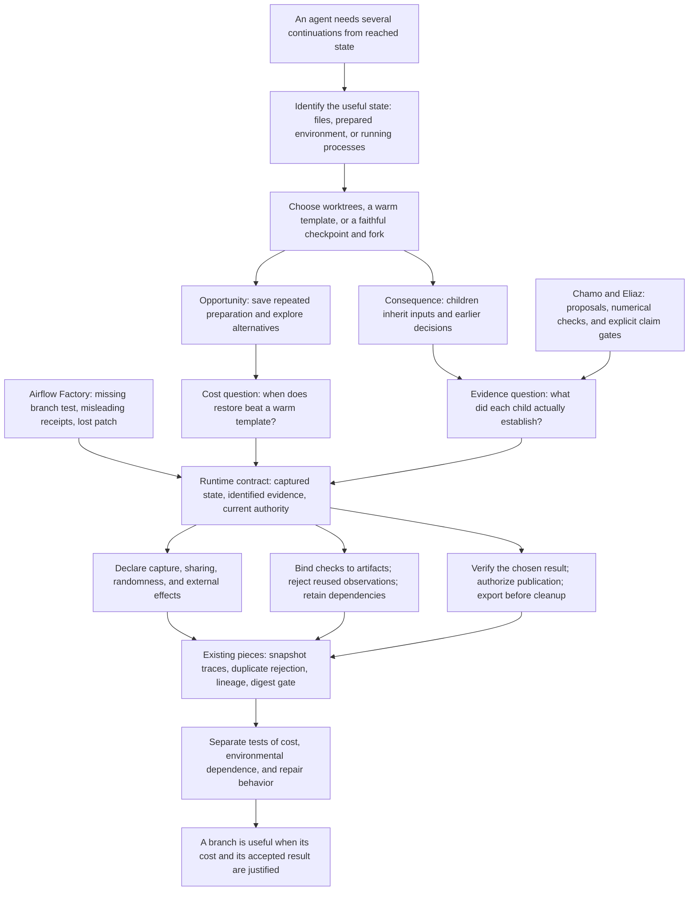
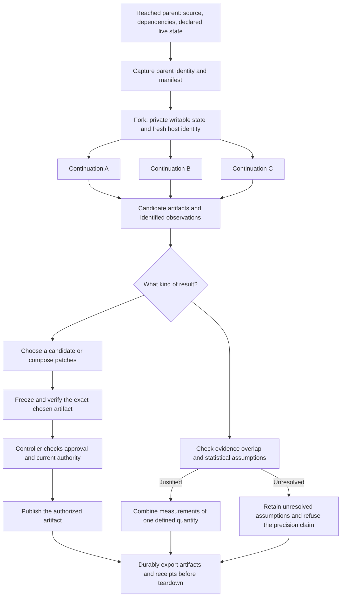
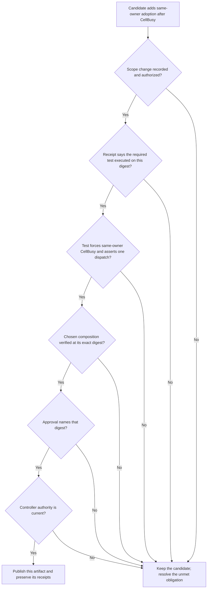

# Forkable sandboxes seminar storyline

This is a proposed reorganization of the whole revised Cambridge deck, with 45 main slides, concrete content, speaker transitions, named systems, and a map back to the PDF. It preserves the factory incidents, runtime mechanics, statistical insights, prototype results, and experimental program. It brings the work with Ori Chamo into the argument. There is no backup section.

The academic claim is deliberately precise: a forkable sandbox can reuse a reached execution state and support alternative continuations. Choose the mechanism according to the state the children actually need: source alternatives may need only worktrees; prepared files may need a warm image; valuable running state may justify a process or VM checkpoint. A complete agent runtime must also preserve the meaning of the evidence those continuations produce and control which result may be published. The factory incidents motivate this contract; the reducer implements a limited part of it; the benefit of an integrated forked factory remains to be tested.

## Presentation rules for the whole deck

Every slide title below is a complete sentence stating its actual takeaway. Measured findings name their setting. Proposed mechanisms and experiments remain visibly proposed. Titles state the finding or requirement rather than promise insight, ask a vague question, or repeat a section name.

Use one diagram, table, code example, or calculation per slide. The audience should be able to read the visual before the explanation moves on. The **On screen** text is a content specification, not a paragraph to paste verbatim: turn it into at most three short labels or claims, except for the three-row timing and API tables. Keep qualifying details, secondary figures, file paths, and full references in the slide comments. Explain unfamiliar terms once and then reuse them.

Keep one concrete state visible: the prepared repository just before the first repair. Keep one concrete candidate visible: the patch adding same-owner adoption after `CellBusy`. Keep one concrete obligation visible: force that path and assert one dispatch. The talk should repeatedly answer a question about this state, candidate, or obligation. This gives technical details a place in the story.

## The short story the audience should remember

An agent reaches a working state and needs to try several continuations. The first decision is which state those continuations need and which mechanism preserves it most economically. A live fork can be useful when the relevant running state survives capture and remains valid for the continuation. Our serial repair case does not yet establish such a need. It exposed missing test coverage, inaccurate receipts, and artifact loss. Those incidents define obligations that any branching workflow must preserve. The proposed runtime tracks captured state, evidence, and authority. The reducer already rejects declared duplicates and carries lineage; the integrated factory remains unfinished. Separate experiments will determine when restore is worthwhile and what shared ancestry does to the measured outcomes.

## The central systems question

Which valuable state must a child inherit, what genuinely new observations can it produce, and what result may it publish? The state question keeps this a fork seminar. The evidence and authority questions make the proposed branch usable in a complete workflow.

The serial case demonstrates source files, installed dependencies, and recorded feedback before the first repair. It does not demonstrate a necessary live heap, stack, or service state. Worktrees and a warm dependency environment are credible alternatives. Sandbox setup took 20.3 s, but that number is not a measurement of the entire reusable prefix. Hosted-model inference state lies outside the guest. A live fork therefore needs a separate representative workload and an equivalent-state comparison.

Use a hypothetical running-application example at the opening to explain that workload. Label it hypothetical. Return to it at the close: identify relevant live state, demonstrate faithful capture, show that the children consume it, and compare restoration with reconstruction from a warm alternative. Applying a patch may invalidate already loaded code, so restart or reload semantics belong to this contract too.

## Proposed talk title

**Forkable sandboxes need explicit contracts for state, evidence, and authority.**

Subtitle: **Branching execution in AI software factories**

The title names the systems primitive and the three responsibilities the talk investigates. The first two minutes should define fork and show its intended use.

## The argument graph

The important logical connection is **case observations → obligations → fork contract → partial implementation → experiments**. The cases contain no forked execution, so they cannot establish a fork speedup or an effect of shared ancestry.

## Opening script

“Imagine a running application reaches a failure that took a long sequence of actions to reproduce. We want to try several continuations from that exact point. A worktree preserves the code. A warm template preserves preparation. A process or VM checkpoint may preserve the reached execution. Which state do the children actually need?

“A fork also shares a past. Its children may inherit observations, fixtures, and earlier decisions. We need to record that sharing and establish what the returned results support. A shared parent alone does not measure their dependence.

“Our measured factory run stayed serial. It does not yet establish that live fork is worthwhile. It reveals the obligations an eventual branch must preserve: the intended scope, the exact behavior checked, recoverable artifacts, and current publication authority. I will use that case to define the branch contract, show the components we have built, and describe the experiments that could justify state reuse.”

## The recurring lifecycle graph

Return to this figure at the beginning, after the case studies, at the prototype, and at the conclusion. Highlight only the edge under discussion.

Journal inputs, ancestry, observation identity, feedback exposure, and external effects along the whole graph. Export also applies to refused, failed, and abandoned branches. Numeric reduction is a separate operation from patch selection. The full graph is a proposed integrated workflow; the existing components are identified on slides 6, 24, and 37.

## Act 1 Why fork a reached state

The audience should leave this act knowing exactly what fork means and why another execution might help. Pages 1–3, 23, and 26 supply the material.

### Slide 1 Forkable sandboxes need explicit contracts for state, evidence, and authority.

**On screen:** Full-sentence title, name, affiliations, and the existing company disclosure. One small parent-to-children figure. Save the subtitle for the talk listing.

**Visual:** One parent branching into three children, followed by one accepted artifact.

**Say:** Give the opening scenario. Define the problem before presenting personal research history.

**Connection:** “What exactly would the children inherit?”

### Slide 2 The branching mechanism must preserve the state the continuation actually needs.

**On screen:** Source alternatives → worktrees. Prepared filesystem → warm image or disk snapshot. Useful running state → process or VM checkpoint. Draw the same next action beginning from each kind of preserved state.

**Keep the detail:** A fork can supply several continuations from one captured parent, with private writable state. A Git worktree duplicates a source view. A process checkpoint may preserve memory and processes. A VM snapshot preserves the VM state its implementation declares. Remote model state and already performed external effects require separate treatment. The hypothetical opening involves running state; the serial repair case establishes files and feedback but no necessary live process state.

**Say:** “Identify what the next action needs. Then choose the least expensive mechanism that faithfully supplies it.”

**Connection:** “Systems have supported versions of this operation for years.”

### Slide 3 Existing runtimes already reuse state for cloning, evaluation, and recovery.

**On screen:** SnowFlock: `VM_fork(N)`, EuroSys 2009, built on Xen. Kimi K3 AgentENV: pause, checkpoint, resume, and sandbox branches for reward evaluation. DeepSeek DSec: recorded commands and cached-result replay on resumption.

**Keep the detail:** The current deck reports Kimi's 51.2 million sandboxes across about 1.51 million images and up to 98% of sandbox lifetime paused during model generation. These are attributed infrastructure figures. Forking a sandbox for judging does not imply that the judge itself is forked.

**Say:** “The primitive is established. Our question is its contract inside an agent workflow.”

**Connection:** “An extra execution helps when it escapes a cause that holds the first one back.”

### Slide 4 A backup request reduced p99.9 latency from 1,800 ms to 74 ms.

**On screen:** BigTable, 1,000-key read; backup after 10 ms; accept the first result. Reported p99.9 latency: 1,800 ms → 74 ms, with 2% additional requests.

**Visual:** Two request lanes and the backup delay.

**Say:** Explain the mechanism behind the number: another server may escape a delay specific to the first server. Shared causes limit the benefit. This is published request hedging, not our fork benchmark.

**Connection:** “For code generation, the opportunity is a better candidate rather than an earlier identical response.”

### Slide 5 250 attempts raised SWE-bench Lite coverage from 15.9% to 56%.

**On screen:** Large Language Monkeys, DeepSeek-Coder-V2-Instruct, SWE-bench Lite: 15.9% coverage at one attempt; 56% at 250 attempts. “Coverage: at least one candidate solves the issue.”

**Keep the detail:** Coverage does not give production selection accuracy. Stroebl et al. show that false acceptance costs can make the useful number of attempts small, often below ten under their conditions.

**Say:** “The collection can contain a correct patch while the workflow accepts a wrong one.”

**Connection:** “So we need separate accounts of execution cost and accepted-result quality.”

### Slide 6 We built evidence accounting; the integrated forked factory remains proposed.

**On screen:** Measured: two factory work orders and distinct sandbox API paths. Built: exact duplicate-evidence rejection, lineage transport, and an artifact digest gate. Proposed: the integrated fork lifecycle, dependence-aware uncertainty, and restore authority rules.

**Say:** “No case-study run forked. We observed obligations a branching system must preserve, and implemented some of the accounting.”

**Connection:** “Start with the complete workflow that produced those obligations.”

## Act 2 Follow one software factory through a repair

The audience should understand the task, the unexpected change, the missing test, and the delivery problem. Every failure will become a named requirement in the next act. Pages 7–20 supply the material.

### Slide 7 The factory ran one hosted model through separate stages and checks.

**On screen:** Airflow Factory → specification → approved plan → edits → harness tests → repair → review → delivery. Stack: Apache Airflow sandbox toolset, Docker Sandboxes, one hosted model served through Databricks across agent roles.

**Keep the detail:** Approval responses came from the harness and were recorded as human mode. The cell was unmanaged; sandbox authority leases were not exercised. Workgraph execution recorded `serial_fallback_missing_fork`.

**Say:** Explain the agent, harness, and controller as separate actors. This was a factory proposing changes to its own repository.

**Connection:** “The original work order was a concrete installer failure.”

### Slide 8 The uv installer failed at two redirect hosts missing from the policy.

**On screen:** `astral.sh/uv/install.sh` → `releases.astral.sh` → possible GitHub release asset at `release-assets.githubusercontent.com`. The policy began with six allowed hosts and omitted these two. Observed outcome: HTTP 403; uv unavailable.

**Keep the detail:** The installer failure was observed on the sandbox platform and became the work order executed through Docker Sandboxes. A shared release-asset hostname permits more than this installer. Digest-addressed fetching is a proposed refinement.

**Say:** “The requested change was to add the two redirect destinations wherever the allowlist was stated.”

**Connection:** “The approved plan made both scope and completion concrete.”

### Slide 9 The approved plan limited the allowlist update to six files.

**On screen:** Python allowlist check, shell bootstrap, regression tests, deployment script, and two documentation files: six files in total. Acceptance: both hosts present, policy statements agree, hermetic regression checks pass.

**Keep the detail:** File paths in notes: `src/swfactory/doctor.py`, `deploy/islo/bootstrap.sh`, `tests/test_doctor.py`, `deploy/islo/deploy.sh`, `docs/islo.md`, `docs/selfhost.md`. Dispatch ownership was outside the plan.

**Say:** “We can identify an out-of-plan edit because the boundary was recorded before editing.”

**Connection:** “Here is the whole run, with the work behind each timing.”

### Slide 10 Two repairs and two reviews used 59% of recorded stage time.

**On screen:**

| Stage | Work performed | Time | Reported model cost |
|---|---|---:|---:|
| Specification and plan | Acceptance conditions and six-file plan | 3:41 | $0.96 |
| Build and test | Three edit tasks, failing suite, first repair | 20:01 | $4.50 |
| Review | Review, second repair, tests, re-review | 18:55 | $4.87 |

**Caption:** 43:44 elapsed; $10.33 total reported model cost. Sandbox setup: 20.3 s.

**Callout:** Two repair sessions and two review sessions consumed 25.2 minutes and $7.75: 59% of recorded stage time and 75% of model cost.

**Keep the detail:** Recorded stage total 42:38 (2,557.517 s); wall time 43:44 (2,624 s), from 11:39:56 to 12:23:40. The roughly 66 s difference is outside those recorded stage totals. Session timings include tool activity. Setup took 20.3 s; a 100× faster setup saves about 20.1 s, around 0.8% of stage time. Setup is not a measurement of the whole reusable prefix and does not establish or rule out the value of a different reached state.

**Say:** “The long run came from repair and review. To understand it, look at the failed test that changed the task.”

**Connection:** “The repair agent diagnosed a split between two kinds of ownership.”

### Slide 11 The repair agent diagnosed different owners for the lease and active cell.

**On screen:** Four replicas claim the same intent with a zero-duration dispatch lease. Replica A activates the cell; replica B holds the final dispatch token. A receives `DispatchLeaseLost`; B receives `CellBusy`. The recorded diagnosis reports zero Airflow runs.

**Visual:** Two ownership lanes meeting at dispatch, with the incompatible outcomes labeled.

**Keep the detail:** This is the repair agent's recorded diagnosis of the failing test. The dispatch coordination lease here is different from the unused sandbox authority lease on slide 7.

**Say:** “The proposed repair let the current owner adopt an already active cell belonging to the same work order.”

**Connection:** “That new behavior created a precise test obligation.”

### Slide 12 The suite had no failures, but the new adoption path lacked a direct test.

**On screen:** New behavior: `CellBusy` + same work-order ownership → adopt current active cell. Required check: force that path and assert exactly one successful dispatch. Existing tests covered helper adoption through another path and refusal of a foreign owner.

**Keep the detail:** The direct same-owner `CellBusy` test remained absent. The final suite reported 1,972 cases, including skips, with zero failures. The second review approved and treated the missing test as minor.

**Say:** “A green suite answers the questions it actually exercises. Here the newly introduced path still needed a deterministic check.”

**Connection:** “The test gap persisted through the workflow's own restrictions.”

### Slide 13 The second repair changed code while the requested test remained absent.

**On screen:** Review requested a deterministic test. The second repair reported that the tests directory was protected, then refactored an existing recovery path onto the adoption helper. The review subsequently accepted the patch.

**Keep the detail:** The public record contains 15 allowed edits, six by repair agents; the test-edit hook did not fire. The record does not establish an observed blocked test-edit attempt. Scope expansion and test coverage are separate issues.

**Say:** “The workflow needed an explicit decision about scope and a required receipt for the new behavior. Another general review could not supply that missing test.”

**Connection:** “Even an accepted candidate still needs a reliable delivery lifecycle.”

### Slide 14 Delivery was refused three times, and cleanup lost the patch.

**On screen:** Second recorded work order: about 26 minutes elapsed, 853.8 s of recorded stages, $3.43 model cost, 1,981 reported tests with no failures, approved review. Delivery refused three times. Teardown lost the patch; no PR resulted.

**Keep the detail:** The review found an unexpected file that was a review archive mirrored into the workspace. The supplied deck does not specify the original requested change. Present this as a delivery and recovery incident, with that limitation in notes.

**Say:** “The controller can refuse delivery and still preserve the candidate for investigation or recovery.”

**Connection:** “Preservation is useful only if the saved records describe what really happened.”

### Slide 15 The records included skipped checks, mislabeled approvals, and missing input bytes.

**On screen:** Three concrete examples: CI green in about three seconds although the relevant step was skipped without a key; a harness response recorded as a human approval; an adapter digest recorded while its source remained outside Git and unrecoverable.

**Keep the detail:** Use typed statuses `executed`, `skipped`, `failed` and actors `human`, `harness`, `service`. Bind the receipt to the candidate and obligation. Save retrievable adapter bytes and external responses where replay requires them. CLI status text contaminating JSON stdout is a further parsing example in notes.

**Say:** “Authentic records can still encode the wrong semantics. A digest identifies bytes; replay also needs access to those bytes.”

**Connection:** “These incidents give us requirements for the runtime around the agent.”

### Slide 16 Branching must preserve scope, test obligations, and recoverable artifacts.

**On screen:**

| Observation | Required mechanism |
|---|---|
| Unexpected repair | Scope amendment and new behavioral obligation |
| Missing branch test | Artifact-bound receipt for that explicit obligation |
| Misleading receipt | Typed execution status and actual actor |
| Lost patch | Durable export before teardown |
| Missing adapter source | Recoverable input bundle |
| Future branching | Captured-state manifest, sharing policy, fresh authority |

**Say:** “A forked factory will have more states and more candidate results to manage. These obligations need to survive branching.”

**Concrete proposed branch point:** Repository prepared, dependencies installed, failing suite recorded, just before the first repair. Draw three alternative repair continuations from this parent. This is a counterfactual design, not an event in the serial case study. Its demonstrated state may be supplied by worktrees and a warm template. Mark live-process reuse as unestablished. Keep this parent and its same-owner adoption candidate visible through the design and analysis sections.

**Connection:** “First define what the branching mechanism actually preserves.”

## Act 3 Define the fork operation and its lifecycle

The audience should understand the state boundary, the authority boundary, external effects, and the cost baseline. Pages 18, 21–36 supply the material.

### Slide 17 Worktrees, checkpoints, and replay preserve different kinds of state.

**On screen:** Source/build state: Git worktrees, OBuilder. Process state: CRIU; gVisor supplies a userspace-kernel sandbox with its own save/restore semantics. VM state: Xen, SnowFlock, Firecracker snapshots. Recorded observations: rr and DSec replay.

**Keep the detail:** Each row needs its captured surface and limitations. A worktree can parallelize edits without preserving live processes. A recorded response can support replay without executing the remote service again. Networking, time, randomness, and remote model sessions need declared semantics. Ask what state is captured, whether the child consumes it, and whether applying the patch invalidates it. Loaded application code may need a restart or reload; useful state in an unchanged simulator or service is a different case. These are possible workload examples, not observed properties of the allowlist repair.

**Say:** “Choose a mechanism for the state we need to reuse.”

**Connection:** “This explains why the latency figures refer to different operations.”

### Slide 18 Published latency figures measure different operations.

**On screen:** DeltaBox checkpoint 10.83 ms; Kimi AgentENV checkpoint as low as 133 ms and resume as low as 49 ms; Shepherd fork 134–143 ms; SnowFlock remote fork 600–800 ms; Firecracker boot to application code under 125 ms. Preserve each row's source and qualification.

**Keep the detail:** Mechanism lineage in a compact timeline: Xen/live migration/Potemkin → SnowFlock/Catalyzer/Nephele/MITOSIS → agent checkpointing DeltaBox/Shepherd and recovery Crab/Planarian. Recovery systems are not interchangeable fork implementations.

**Say:** “A checkpoint, a resume, a remote fork, and a boot have different endpoints. These figures locate mechanisms; they do not rank them for our workload.”

**Connection:** “Our own restore path needs a fidelity check before we call it a live fork.”

### Slide 19 Restore fidelity needs checks of the state the API claims to preserve.

**On screen:** Write a 128-bit nonce only in RAM. Capture. Restore three children. Check whether it survives. Then compare declared deterministic behavior between restored and direct execution.

**Keep the detail:** Nonce survival is a necessary probe for the claimed memory path, not a complete fidelity proof. If it fails, report restore fan-out and its actual semantics. Probe writable isolation, process identity, clocks, RNG, and sockets as relevant. Hosted-model sampling occurs outside the guest snapshot.

**Say:** “The name of an API cannot substitute for observing the state it preserves.”

**Connection:** “Some inherited state must be refreshed rather than preserved.”

### Slide 20 Each child needs private writable state and host-controlled authority.

**On screen:** Immutable parent identity; private writable child state; host-assigned child identity, generation, expiry, and budget. Publishing credential remains with the controller. The warm cache is immutable and identified within a declared trust domain.

**Keep the detail:** A bearer credential copied into a microVM can remain usable despite kernel isolation. A guest-provided generation string is copied too. Firecracker and gVisor address isolation surfaces; Capsicum and CHERI illustrate explicit authority. Network access still needs an explicit egress policy; controller-held publishing credentials do not implement it.

**Say:** “The child can generate a candidate. Publication is a separate controller decision about a specific artifact.”

**Connection:** “That separation matters because external actions cannot always be rolled back.”

### Slide 21 Restoring local state does not undo completed external actions.

**On screen:** Git writes can be staged; a sent model request has already incurred cost; a remote tool action may already have happened. Proposed effect journal and buffer; reconcile uncertain outcomes or use idempotency where supported. Export artifacts and evidence before every teardown.

**Keep the detail:** Speculator, external synchrony, and Remus supply precedents for delaying output. DSec replays cached command results on resumption. A general effect buffer and reconciliation policy are proposed here.

**Say:** “A snapshot restores local state. The surrounding protocol must account for effects that crossed its boundary.”

**Connection:** “Now we can ask whether this added machinery earns its cost.”

### Slide 22 Forking saves resources when avoided preparation exceeds reuse overhead.

**On screen:** Resource-cost condition `(N−1)P > H + N(R+D)`, where P is repeated preparation, H capture, R restore, D incremental divergence overhead from reuse, and N children. Illustration: N=8, P=30, H=2, R=1, D=3 → 210 resource-seconds avoided, 34 added, 176 saved. Warm P=2 → 14 avoided, 34 added, 20 lost.

**Keep the detail:** This is an additive resource model with illustrative inputs. D can include copy-on-write costs; ordinary continuation work common to both alternatives cancels and is excluded. Batch elapsed time depends on critical paths and contention. In the recorded three edit tasks, ideal unchanged-duration parallelism saves 165.9 s, about 6.5% of stage time, before fork, merge, and verification overhead. Worktrees may provide that parallelism. Jitsu and LightVM illustrate cheap fresh-start alternatives.

**Say:** “Compare equivalent usable states: worktree, warm template, disk restore, or live fork. The state must remain useful after the continuation changes the application.”

**Connection:** “Our existing measurements establish exercised API paths, with their endpoints visible.”

### Slide 23 The API traces measured creation and restore–run–capture separately.

**On screen:** Daytona create: 1,024/1,024, p50 0.20 s, p95 1.12 s. Tensorlake create: 256/256, p50 3.44 s, p95 9.00 s. islo restore–run–capture: 255/256, p50 6.87 s, p95 9.04 s.

**Keep the detail:** islo used a named 141 MB snapshot at requested concurrency 12. The create traces used concurrency 8. Teardown is excluded from per-operation percentiles. Memory capture remains unverified. These are different API workflows, not an isolated restore benchmark or provider ranking.

**Say:** Name islo explicitly. “These traces tell us what path executed. The controlled experiment must isolate the benefit.”

**Connection:** “Here is where the paths sit in the proposed complete runtime.”

### Slide 24 The factory has a publication gate, but its fork store is missing.

**On screen:** Recurring lifecycle graph. Calls: checkpoint → fork → evaluate → select or reduce → verify exact result → promote. Scheduler/journal and work cells exercised; digest gate exercised; reducer built separately; lease broker built but unused in these work orders; fork store missing; external evaluator proposed.

**Keep the detail:** Eight obligations: identified immutable parent; fresh child authority; no guest publication token; input/evidence/feedback records; duplicate rejection and retained shared factors; deterministic composition and conflict retention; verification of the exact composition; durable export before teardown. Status belongs to every obligation.

**Say:** “The contract joins components we have exercised with components we have yet to build.”

**Connection:** “A short stale-worker example makes the authority requirement concrete.”

### Slide 25 A replacement restore must invalidate the old worker epoch.

**On screen:** Logical worker authorized at epoch 1 → replacement restore advances it to epoch 2 → old instance attempts publication at epoch 1 → controller rejects stale authority. Evidence, approval, and publication must name the same frozen artifact.

**Keep the detail:** A concurrent fork receives a new worker identity and its own epoch; it need not revoke a continuing parent. The controller checks identity, current epoch, artifact, scope, and budget. TLA+ design exists. No TLC model-check run or implementation trace check is recorded. Include clone, lease expiry, delayed approvals, and uncertain effects in the model's intended coverage. A model written down is not a checked protocol.

**Say:** “State restoration and authority renewal are coupled protocol events.”

**Connection:** “What comes back from the children: candidate artifacts, compositions, or measurements?”

## Act 4 Interpret the evidence from branches

The audience should distinguish candidate search, patch composition, and statistical pooling. Bring Chamo into the talk as a concrete scientific workflow. Pages 4, 27, 37–46, 55, and selected research records supply the material.

### Slide 26 Selection, composition, and pooling require different evidence.

**On screen:** Three lanes: different patches → select one; compatible patches → compose and test the result; measurements of one parameter → statistical reduction under stated assumptions.

**Keep the detail:** A patch score is not automatically a precision estimate. Common-parameter pooling does not apply to different candidate artifacts just because every worker returned a number. A selector requires its own error and cost evaluation.

**Say:** “The implemented numerical reducer occupies the measurement lane.”

**Connection:** “The work with Ori Chamo supplies a concrete scientific example of a candidate earning its evidence.”

### Slide 27 The Chamo project rejected a numerically unresolved cross-check.

**On screen:** Candidate → screen → verified claim, with the required checks on the connecting arrows. Concrete outcome: an independent RK4 cross-check was unresolved and was rejected as evidence. Credit Ori Chamo beside the figure.

**Keep the detail:** The three-body project examines 135,445 source orbit samples. The preprint reports 26 difficult links checked by bidirectional continuation, connecting apparent projected branches within the sampled component. AI/active learning proposes where to compute; Extra-Trees ranks candidates; shooting/Floquet calculations perform screening. The full project ladder is candidate → numerical screening → high-precision checks → independent reproduction → frozen claim. An independent mpmath RK4 self-test was numerically unresolved and its output was rejected as evidence. That gate is a concrete example of preventing a stronger unsupported claim. The preliminary preprint and repository retain open completeness/release obligations. Do not imply every candidate passed the full ladder or that the unresolved cross-check invalidated every other result.

**Say:** “A plausible numerical proposal, a passed screen, and an admissible scientific claim have different evidence requirements.”

**Connection:** “The factory's patch needs the same explicit distinction between those states. Across domains, we also have to identify what counts as one observation.”

**Sources:** [Chamo and Eliaz preprint](https://ai.vixra.org/abs/2608.0069); [Three-Body Orbit Atlas repository](https://github.com/zozo123/threebody-closing-the-open). This project did not establish a sandbox-fork benefit.

### Slide 28 Source identities must be recorded before treating observations as separate evidence.

**On screen:** Three identity examples: cells → patient; mining addresses → linked agents; execution IDs → observation and test-case IDs. Use two identifiers from one source as the visual, rather than a six-field catalog.

**Keep the detail:** The coauthored Bitcoin study linked most early mining to 64 agents; the malignant-cell study found patient identity relevant to clustering. Perception frames and physical interaction networks are additional methodological context in comments. These connections require domain-specific models and are not empirical evidence about fork outcomes. Credit collaborators in the footnotes. Put biography and full publication details in speaker notes rather than detouring into a CV slideshow.

**Say:** “The recurring habit is to identify the unit and the relationships between units before drawing a conclusion from their count.”

**Connection:** “For this runtime, also specify the population from which those observations came.”

### Slide 29 Checkpoint-started success is conditional on reaching that checkpoint.

**On screen:** Illustration: task reaches checkpoint with probability 0.5; continuation succeeds conditional on that checkpoint with probability 0.8; corresponding end-to-end probability 0.4.

**Keep the detail:** State the illustrative conditioning explicitly. A viable reached state contains information about the prefix; continuation success alone does not estimate how often the workflow reaches it or establish every earlier choice. Go-Explore makes return-to-state and exploration explicit.

**Say:** “A checkpoint-started success rate answers a conditional question.”

**Connection:** “The evidence population also changes when feedback is used to choose repairs.”

### Slide 30 Repair tests and generalization tests support different claims.

**On screen:** Failed test → repair → review feedback → another repair → accepted candidate. Label observations exposed during development. Reserve validation for claims about generalization or selection performance, and record the selection event.

**Keep the detail:** A regression test used during repair still establishes the deterministic behavior it actually asserts on the checked artifact. Untouched evaluation is needed for appropriate claims beyond that behavior. One hosted model performed the agent roles in the case; no agent-dependence estimate was obtained. Related work: adaptive data analysis; Kimi diagnostic versus held-out verifiers; METR and ImpossibleBench as documented verifier-risk examples.

**Say:** “Feedback changes the candidate. Keep its role visible when interpreting the final evidence.”

**Connection:** “Three questions prevent us from asking a receipt to prove too much.”

### Slide 31 A check can run correctly and still miss the required behavior.

**On screen:** Execution integrity: did this check run on this artifact? Behavioral coverage: did it force and assert the required path? Statistical support: does this collection support the proposed uncertainty or generalization claim?

**Visual:** Apply the three questions to the same-owner adoption candidate from slide 12.

**Keep the detail:** Artifact binding and an external recorder address integrity. A targeted test addresses coverage. A suitable sampling and dependence model addresses statistical support. The absent adoption test is a coverage gap; duplicate rejection cannot detect it by itself.

**Say:** “These are separate checks with separate mechanisms.”

**Connection:** “Now distinguish copied evidence from repeated observations.”

### Slide 32 Distinct execution IDs do not make copied evidence new.

**On screen:** A and B both return evidence token e1 → duplicate rejected. A returns e1, B returns e2, both inherit parent p → different observations, unresolved dependence. One hundred cases run four times → 400 outcomes grouped within 100 case identities.

**Keep the detail:** Distinguish execution ID, candidate digest, observation ID, and test-case ID. A genuinely fresh stochastic evaluation can get a new observation ID while retaining the case and ancestry cluster. A copied receipt remains the original observation.

**Say:** “Record freshness and relationships separately.”

**Connection:** “For averages, we can show exactly how a stated dependence assumption affects precision.”

### Slide 33 At correlation 0.1, 100 measurements have the mean precision of about nine.

**On screen:** `N_eff=N/[1+(N−1)ρ]`. Show 100 measurements → about 9.17 at ρ=0.10. Put the equal-variance/common-correlation assumption directly under the calculation.

**Keep the detail:** The underlying formula is `Var(mean)=σ²[ρ+(1−ρ)/N]`. Nine measurements give effective sizes 9 at ρ=0, 5 at ρ=0.10, and 1.8 at ρ=0.50. This is variance-equivalent sample size for a mean under the model. It is not a probability of correctness and does not remove common bias. Published judge-panel comparisons are context: Kohli's nine-judge panel had estimated effective size 2.18; 9.1% of 319 unanimous MNLI decisions were wrong. Kim's conditional wrong-answer agreement is a different statistic, not ρ. Neither result is a measurement of fork effects. Additional original-slide examples stay in comments: under independent draws, a 1% slow-request probability gives about 63% probability of at least one slow request in a 100-way fan-out; a hypothetical 10% failure rate gives 0.9^29≈0.047 probability of 29 green trials. Amdahl's similar algebra is an analogy. Poolkeh's modeled 295,951 tests for about nine million people concerns a different pooling operation.

**Say:** “Additional related observations can add information, but the independence formula can overstate it.”

**Connection:** “Even pairwise dependence does not completely describe candidate search.”

### Slide 34 Zero pairwise correlation does not fix the all-wrong probability.

**On screen:** Three binary error indicators, each wrong with probability 1/2 and pairwise correlation zero. Equiprobable patterns `000,011,101,110` → all-wrong probability 0. All eight patterns → 1/8. Equiprobable `001,010,100,111` → 1/4.

**Keep the detail:** Define 1 as an error. Marginals and pairwise correlations match across these three joint distributions. Search coverage depends on the joint all-fail probability. A good selector must still recognize the correct candidate when one exists.

**Say:** “The effective-size calculation for an average cannot answer this candidate-search question.”

**Connection:** “Some sharing is deliberately useful when the question is a comparison.”

### Slide 35 Shared conditions can reduce uncertainty in a paired comparison.

**On screen:** Compare A and B on matched conditions. `Var(A−B)=Var(A)+Var(B)−2Cov(A,B)`. Positive shared variation can reduce the variance of the difference.

**Keep the detail:** Common random numbers require control of the relevant randomness. Cloning a guest PRNG seed does not control hosted-model sampling. Draw ancestry links separately from shared fixture, test, retrieval, evaluator, and feedback links: an execution tree alone omits important relationships.

**Say:** “The appropriate sharing policy depends on the quantity we want to estimate.”

**Connection:** “For patch composition, the relevant relationship can involve more than pairs.”

### Slide 36 Passing every pair does not establish that the full composition passes.

**On screen:** Capacity limit of two workers. Three patches each add one worker. Every individual patch and every pair passes; all three together exceed the limit. With eight candidates, 28 pairs exist but 256 subsets exist.

**Keep the detail:** Pairwise conflict indicators can miss higher-order effects. Verify the exact selected composition; bind the receipt to its digest. Reduction of numerical summaries does not solve patch composition.

**Say:** “Acceptance concerns the actual artifact we will publish.”

**Connection:** “Here is the part of evidence accounting we have implemented.”

## Act 5 Show the implemented evidence reducer

The audience should see code-enforced behavior, quantitative checks, and the remaining trust boundary. Pages 43 and 47–49 supply the material.

### Slide 37 The reducer rejects declared duplicates and retains lineage.

**On screen:** Record: estimate, reported information or uncertainty, sample count, evidence IDs, lineage, execution metadata. Demonstrate repeated ID rejection and transport of lineage with the result. Calibration remains a statistical assumption; field validation does not establish it.

**Keep the detail:** The Gaussian reference reducer adds natural-parameter summaries and retains a disagreement statistic. Exact repeated declared IDs are rejected by default. Different IDs with a shared parent are accepted; dependence adjustment and conservative refusal remain proposed. Production authenticated manifests require more than worker declarations.

**Say:** “This is an enforceable interface boundary. The independence and common-target assumptions still belong to the caller.”

**Connection:** “The numerical checks exercise that defined scope.”

### Slide 38 Information pooling outperformed equal averaging on the synthetic logistic shards.

**On screen:** One two-bar chart: gap to centralized MLE 0.0083 for information pooling versus 0.177 for equal averaging. Caption: five synthetic logistic shards, sizes 60–5,000; mean across eight fixed seeds. Show the SD whiskers with a label identifying them as SD.

**Keep the detail:** Logistic results are 0.0083 ± 0.0042 versus 0.177 ± 0.090, mean ± SD across eight fixed seeds. Sample-size weighting was not compared. Separate integration check: four workers from a named snapshot returned pooled synthetic mean 4.9422 versus full-sample mean 4.9450; concurrent restore–run–capture took 6.70 s. These checks exercise numerical pooling, provenance, and the snapshot-to-reducer path. They do not measure agent-task accuracy or dependence correction. Use the current paper title, Evidence-Aware Reduction for Forkable Compute.

**Say:** “The useful result is that the record and algebra execute as specified.”

**Connection:** “A worker can still lie about the strength of its evidence.”

### Slide 39 Inflated reported precision pushed the synthetic pooled estimate to 17.0004.

**On screen:** A distant scalar estimate from a 2,000-point shard inflates reported precision 50×. Unprotected pooled estimate: 17.0004. Stress heuristic: 4.9566.

**Keep the detail:** The heuristic illustrates one attack and is not a Byzantine guarantee. Trusted recomputation under the numerical model can validate information. Agent scores require a separately validated error model. These extensions are proposed. An external writer of receipts alone cannot establish that a reported uncertainty is calibrated.

**Say:** “The runtime must preserve evidence identity, and the statistical procedure must justify the weight assigned to it.”

**Connection:** “The complete workflow can now state what each decision requires.”

## Act 6 Evaluate the proposal and return to the original case

The audience should leave with falsifiable questions and a useful next experiment. Pages 50–58 supply the material; the old detailed decision rules must be reconciled with the stated design limitations.

### Slide 40 A proposed obligation gate would withhold this candidate until the missing test passes.

**On screen:** Same-owner adoption candidate → scope recorded → required branch test → typed artifact-bound receipts → selection or composition → exact artifact verification → current-authority gate → publication. Durable export on every exit.

**Keep the detail:** Use the missing test as the concrete required obligation. The proposed obligation gate would keep that item unresolved until the specified check exists. The existing reducer does not enforce this requirement. A small pilot can reveal shared failure classes; it cannot certify rare false acceptance or low dependence.

**Say:** “Branching creates alternatives. This contract specifies what allows an alternative to become an accepted result.”

**Connection:** “The first experiment asks whether reached-state reuse beats its strongest simple alternative.”

### Slide 41 The proposed cost experiment compares restore with a warm cached template.

**On screen:** Unrun preregistered H1. Warm template versus restore after setup and one warm test. N={3,6,12}; 20 interleaved batches per arm and N; no model calls. Endpoint: request to the last child's first test result. Cold start is a reference.

**Keep the detail:** Establish capture semantics and declared fidelity first. Report restore failures with timing. Support threshold: 95% CI lower bound on median gain above 10 s at every N; rejection threshold in the current protocol uses Bonferroni 98.3% upper bounds below 10 s at any N. Predeclare capture amortization and failure treatment. Keep resource cost separate from batch latency. A timing win justifies the exercised restore path on this workload; it does not establish that live memory was necessary. A live-state-benefit experiment additionally needs representative running state, faithful capture, children that consume that state, and a warm alternative that reconstructs equivalent usable state.

**Say:** “A warm-cache win is an informative result about this workload.”

**Runtime decision informed:** Choose restore or a warm template for this workload and fan-out.

**Connection:** “Speed does not establish whether sibling outcomes share environmental failure causes.”

### Slide 42 The proposed sibling experiment measures environmental co-failure.

**On screen:** Unrun preregistered H2. Twelve snapshot families with three siblings; compare shared-parent restores with separately prepared restores at matched host/slot. At least 300 lockstep race-test rounds per condition. Record outcome and failure class.

**Keep the detail:** Before collecting data, identify a varying parent-state feature that capture preserves and the test actually consumes. A test that recreates all relevant backend state may remove the proposed treatment. The protocol measures environmental co-failure, not hosted-model judgments or final patch quality. Separately prepared states may still share other causes.

**Say:** “This experiment isolates a runtime question. It does not yet calibrate agent confidence.”

**Runtime decision informed:** Decide whether captured ancestry belongs in the uncertainty model for these race-test observations.

**Connection:** “The inference must respect how families and rounds were reused.”

### Slide 43 Shared families and repeated rounds require an analysis that accounts for dependence.

**On screen:** Shared families across comparisons; temporal dependence across rounds; host/scheduling assignment; restore failures; nonzero baseline dependence. Example for nine measurements: stranger ρ=0.10 → N_eff=5.0; sibling ρ=0.15 → N_eff≈4.1.

**Keep the detail:** Proposed amendment: use independently assigned family blocks, or a justified model that accounts for overlap and temporal dependence. The detailed p58 independent sign-flip rule cannot be retained without resolving reused-family dependence. An excess Δρ=0.05 alone does not imply the zero-baseline value N_eff≈6.4.

**Say:** “Declare the experimental unit and the analysis before collecting outcomes.”

**Connection:** “Finally, return to the disputed repair itself.”

### Slide 44 Testing the disputed path and resampling the repair answer different questions.

**On screen:** First: freeze the candidate and force `CellBusy` with same-owner adoption; assert one dispatch. Separately: nine repair resamples with fixed input, prompt, policy, and hosted-model endpoint; record scope edits, distinct diffs, and claimed test evidence.

**Keep the detail:** Both proposed and unrun. The recorded prediction is at least five of nine repeats of the out-of-plan edit. Exact original pre-repair tree equivalence is unconfirmed; the public substitute requires qualification. Resampling describes repeatability and cannot demonstrate an effect of the guest snapshot on hosted-model sampling.

**Say:** “The targeted test answers the original missing behavioral question. Resampling answers a different question about repair repeatability.”

**Runtime decisions informed:** Resolve this candidate's behavioral obligation; separately characterize how stable the repair behavior is under the stated sampling setup.

**Connection:** “We can now return to the first figure and identify exactly what is known.”

### Slide 45 The runtime must preserve shared history and verify the result before publication.

**On screen:** Recurring lifecycle graph with three labels: state boundary, evidence boundary, authority boundary. Completed: recorded factory incidents, exercised API paths, duplicate rejection, lineage transport, artifact digest gate. Open: controlled fork benefit, environmental dependence, calibrated uncertainty, restore authority protocol.

**Close the experimental loop:** Put H1 on the capture/fork choice; H2 on the evidence interpretation; the targeted test on the adoption candidate; resampling on repair generation. Each experiment should change a runtime decision rather than merely add another statistic.

**Two research questions:** Can a manifest of ancestry, fixtures, and feedback support a calibrated dependence model or a justified refusal rule? Can restore renew authority and reject stale publication across failures and uncertain effects?

**Return to the opening:** Revisit the hypothetical running failure. The next decisive systems result is a relevant reached state that survives capture, remains useful in private continuations, and costs less to restore than to reconstruct from a warm alternative. The existing artifact and evidence checks do not yet demonstrate that integrated result.

**Closing words:** “Fork is an execution option. The contract records what each continuation used, what it established, and what it may publish. The experiments determine when state reuse and dependence handling improve the workflow.”

## Acceptance decision tree for the concrete case

This is a proposed policy, not a description of the current implementation. The entire acceptance path records and preserves artifacts on all exits.

Claims about generalization, ensemble confidence, or selection accuracy require an additional suitable evaluation design. They are not implied by passing this deterministic regression path.

## Map from the revised PDF to this main deck

| PDF pages | Where the material goes |
|---|---|
| 1 | Slide 1; explicit definition added on slide 2 |
| 2–3 | Slides 4–5 |
| 4 | Slide 28; selected personal research connections, with domain limits |
| 5 | Self-driving workflow context incorporated into opening/slide 7; etymology and terminology politics removed |
| 6 | Slide 6 |
| 7–9 | Slides 7–9 |
| 10 | Slide 10 with clearer title, actors, and timing explanation |
| 11–13 | Slides 11–13 |
| 14 | Slide 30; verifier-risk sources attached to the corresponding claim |
| 15 | Slide 14 |
| 16–17 | Slide 15 |
| 18 | Slides 2, 17, 19 |
| 19 | Slide 22; ideal bound retained with assumptions |
| 20 | Slide 16; mechanism mismatches corrected |
| 21–22 | Slide 20 |
| 23 | Slide 3; API semantics on slide 24 |
| 24–25 | Slides 17–18 |
| 26 | Slide 3 |
| 27 | Slide 29; absolute claim about prefix removed |
| 28–29 | Slides 19–20 |
| 30 | Slide 21 |
| 31 | Slide 22 |
| 32 | Slide 23; islo named |
| 33–35 | Slide 24 with all lifecycle obligations in its content and notes |
| 36 | Slide 25 |
| 37 | Slide 26 |
| 38 | Slide 30; regression evidence distinguished from held-out generalization |
| 39 | Slide 32 |
| 40 | Slide 34 |
| 41–42 | Slide 33; formula scope and external-study limits retained |
| 43–44 | Slides 35, 37; Chamo/field connections on slides 27–28 |
| 45 | Slide 35 |
| 46 | Slide 36 |
| 47 | Slide 37 |
| 48 | Slide 38 |
| 49 | Slide 39 |
| 50 | Slide 41 |
| 51–52 | Slides 42–43 |
| 53 | Slide 44 |
| 54 | Slide 40 |
| 55 | Slides 33 and 40; judge statistic and pilot limitation kept distinct |
| 56–57 | Slide 45 |
| 58 | Slides 41–43 and notes; conflicting independence assumption replaced by explicit amendment requirement |
| 59–61 | Selected relevant work woven into slides 27–28 and speaker introduction; full bibliographic detail stays in notes |
| 62–64 | References on their corresponding slides and in notes |

The removal is material without a job in the argument: etymology, current political terminology, repeated conclusions, and a detached publication tour. The runtime, case-study, mathematical, and experimental content remains in the main sequence. Bibliography belongs alongside the claim it supports.

## Main source record

The 64-page user-supplied revised PDF is the primary deck source. Existing local run records were used to clarify timing, scope, test counts, and actors. Public project sources:

- [Cambridge talk and preregistration](https://github.com/zozo123/cam-talk-london-26)
- [Airflow Factory](https://github.com/zozo123/ariflow-swfactory)
- [Evidence-Aware Reduction for Forkable Compute](https://arxiv.org/html/2607.09689v4)
- [Reducer implementation](https://github.com/zozo123/boltzmann-mapreduce)
- [Chamo and Eliaz continuation preprint](https://ai.vixra.org/abs/2608.0069)
- [Three-Body Orbit Atlas](https://github.com/zozo123/threebody-closing-the-open)

Keep the original slide references for the published systems, hedging, sampling, dependence, and adaptive-analysis work. The outline supplies structure and proposed narration; it does not turn unrun protocols or unimplemented mechanisms into results.
